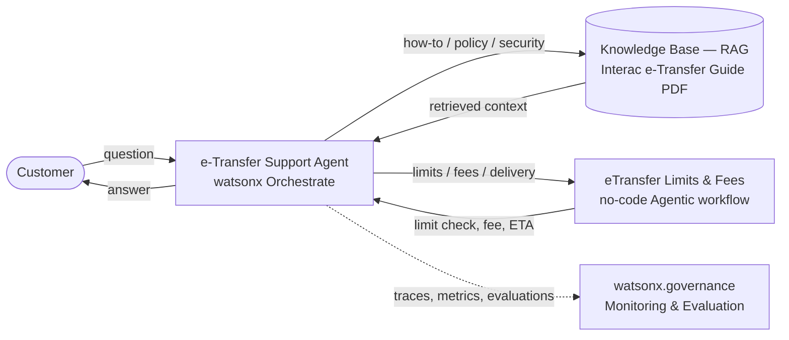

# Lab 1: Interac e-Transfer Support Agent with RAG and a Limits/Fees Tool (~50 min)

> **In this lab** you'll build a complete Interac e-Transfer support agent from scratch in watsonx Orchestrate — no code required. You'll give it a RAG knowledge base over an e-Transfer support guide so it can answer policy, how-to, and security questions, then add a custom no-code tool that calculates sending limits, fees, and delivery times by account tier. Finally you'll deploy it and read the live monitoring dashboard. **By the end, you'll know how to stand up an agent that both retrieves answers and executes real logic — and how to watch its adoption, cost, quality, and safety once it's in production.**

> **Interac watsonx Enablement Workshop.** Scenarios, personas, and data in this lab are fictional and for demonstration only.


## Table of Contents
- [Architecture](#architecture)
- [Use Case Description](#use-case-description)
- [Pre-requisites](#pre-requisites)
- [Step-by-Step Instructions](#step-by-step-instructions)
  - [Part 1: Create the e-Transfer Agent](#part-1-create-the-e-transfer-agent-in-watsonx-orchestrate)
  - [Part 2: Add Knowledge Base (RAG)](#part-2-add-knowledge-base-rag)
  - [Part 3: Build the Limits/Fees Tool (Agentic Workflow)](#part-3-build-the-limitsfees-tool-agentic-workflow)
  - [Part 4: Production Agent Monitoring](#part-4-production-agent-monitoring)

## Architecture

The agent is built in watsonx Orchestrate and combines three capabilities: (1) a **Knowledge base (RAG)** over an Interac e-Transfer support guide, so the agent can answer how-to, policy, and security questions; (2) a **custom limits/fees tool built as a no-code Agentic workflow** that runs inside Orchestrate — it checks sending limits, calculates fees, and estimates delivery time by account tier (no external hosting); and (3) **agent evaluation and production monitoring** via watsonx Orchestrate and watsonx.governance.



## Use Case Description

A support team wants a smarter way to handle everyday Interac e-Transfer questions from customers. This lab builds an AI-powered **e-Transfer Support Agent** that:

1. **Uses RAG**: retrieves answers from an Interac e-Transfer support guide to explain how to send, request, and receive money, how Autodeposit works, delivery times, fees, and security best practices.
2. **Adds a limits/fees tool**: a no-code Agentic workflow that checks whether a transfer is within the customer's account-tier limits, calculates the applicable fee, and estimates delivery time.

This demonstrates knowledge-base integration, building a tool with the **no-code Agentic workflow builder**, and agent evaluation & production monitoring.

## Pre-requisites

- Access to an IBM watsonx Orchestrate instance
- Familiarity with AI agent concepts (instructions, tools, knowledge bases)
- Files provided in this lab folder: `Interac_eTransfer_Guide.pdf`, `etransfer-agent-test-cases.csv`

> No external service is required — the limits/fees tool is built inside Orchestrate in Part 3. *(An optional OpenAPI/FastAPI version of the same tool is included under `instructor/` for anyone who prefers a hosted API — not needed for this lab.)*

## Step-by-Step Instructions

### Part 1: Create the e-Transfer Agent in watsonx Orchestrate

#### 1.1 Access watsonx Orchestrate
1. Go to IBM Cloud (From your email - Click **Join now**）

   

3. **Resource list** → **AI / Machine Learning** → **watsonx Orchestrate** → **Launch watsonx Orchestrate**.
   

4. Click the hamburger menu (☰) and select **Build**.

   

#### 1.2 Create the Agent
1. Click **Create agent +** → **Create from scratch**.

   

2. Enter:
   - **Name**: `e-Transfer Support Agent-<your-initials>`
   - **Description**:
     ```
     This agent helps customers with Interac e-Transfer questions. It uses RAG over an e-Transfer support guide to explain how to send, request, and receive money, Autodeposit, delivery times, fees, and security best practices. It also uses a custom tool to check sending limits, calculate fees, and estimate delivery time by account tier.
     ```
  
   

### Part 2: Add Knowledge Base (RAG)

#### 2.1 Upload the e-Transfer Guide
1. Click **Knowledge** section → **Add Source** → **New Knowledge**.


2. Select **Upload Files** → **Next**.

   

3. Drag and drop `Interac_eTransfer_Guide.pdf` (from this Lab 1 folder) into the upload area.

   

4. Click **Next** after the upload completes.

   

#### 2.2 Configure Knowledge Base
1. **Name**: `eTransfer-knowledge`
2. **Description**:
   ```
   Interac e-Transfer how-to and policy guide: how to send, request, and receive money; how Autodeposit works; security and fraud-awareness best practices; and troubleshooting / FAQs. Use this ONLY for explanatory "how does it work" questions. Do NOT use it for specific limit amounts, fees, or delivery estimates — those are calculated by the "eTransfer Limits & Fees" tool.
   ```
3. Click **Save**.

   

4. Verify the source appears, then click **Edit details**.

   
   

5. Click **Edit knowledge settings** → choose **Dynamic**, set **Maximum Search Results** to **10** → **Save**.


   

   > Indexing runs in the background — continue to Part 3 while it finishes.

6. Click the agent name at the top to return to the agent builder.

   

### Part 3: Build the Limits/Fees Tool (Agentic Workflow)

Instead of hosting an external service, we build the limits/fees logic as a **no-code Agentic workflow** that runs inside watsonx Orchestrate — nothing to deploy.

> All limits and fees below are **illustrative sample values** for the demo (they match the table in `Interac_eTransfer_Guide.pdf`).

#### 3.1 Start the workflow
1. Go to the **Tools** tab → **Add tool +**.

   

2. Under **Create**, choose **Agentic workflow** → **Start Building**.
   

3. Name it `eTransfer Limits & Fees`. Click **Start Building**. Click **Edit Details** to add the description:
   ```
   Calculates the exact Interac e-Transfer sending limit, fee, and estimated delivery time for a given account tier, and checks whether a specific amount is allowed. Use this for ANY question about limits, fees, how much can be sent, whether a specific dollar amount is allowed, or how long a transfer takes — these must be computed, not retrieved from the knowledge base. Requires account_tier, transfer_type, and amount.
   ```

#### 3.2 Define the inputs
Click **0 inputs** at the top of the flow, then click **Add** for each parameter (the agent fills these from the customer's question):


| Input | Type | Required | Default |
|-------|------|----------|---------|
| `account_tier` | String | **On** | — |
| `amount` | Decimal | Off | `0` |


> **Number-typed defaults:** for `amount`, the default must be the number `0` — a numeric input rejects an empty-string default.

> If the canvas started with a **Text extractor** node, delete it (we don't process documents) — select it and click the trash icon.

#### 3.3 Add the logic (Logic block)
From **Flow nodes → Logic block**, drop a **Logic block** between the start and end. Click **Open code editor** and paste:


```python
# Interac e-Transfer limits / fees — illustrative sample values for the demo.
# Per-transaction limits and fees match the Support Knowledge Base guide.
tiers = {
    "personal basic":   {"limit": 3000,  "limit_txt": "$3,000",  "fee_txt": "$0.00"},
    "personal premium": {"limit": 5000,  "limit_txt": "$5,000",  "fee_txt": "$0.00"},
    "small business":   {"limit": 25000, "limit_txt": "$25,000", "fee_txt": "$1.50"},
}

# Read the inputs (watsonx Orchestrate exposes them on `self`)
try:
    raw_tier = self.account_tier
except AttributeError:
    raw_tier = ""
try:
    raw_amount = self.amount
except AttributeError:
    raw_amount = None

# Normalize
tier = (raw_tier or "").strip().lower()
try:
    amt = float(raw_amount)
except (ValueError, TypeError):
    amt = None
if amt is not None and amt <= 0:
    amt = None

# Build the reply
if tier not in tiers:
    answer = "I can help with limits and fees. Which account tier are you on - Personal Basic, Personal Premium, or Small Business?"
else:
    info = tiers[tier]
    tier_name = tier.title()
    answer = ("Here are the e-Transfer limits and fees for a " + tier_name + " account:"
               + "\n- Per-transfer sending limit: " + info["limit_txt"]
               + "\n- Fee per transfer: " + info["fee_txt"])
    if amt is not None:
        amt_txt = "$" + str(int(round(amt)))
        if amt <= info["limit"]:
            answer = answer + "\n\nYour " + amt_txt + " transfer is within the limit, and the fee would be " + info["fee_txt"] + "."
        else:
            answer = answer + "\n\nYour " + amt_txt + " transfer is above the " + info["limit_txt"] + " per-transfer limit, so it would be declined. Try sending it in smaller amounts."

# IMPORTANT: assign the result to self.<output name>. The Logic block does NOT
# auto-capture bare local variables — you must write self.answer.
self.answer = answer
```

> ⚠️ **Two rules for outputs.** (1) **No `return` statement** — the Logic block is not a function; `return {...}` fails with `SyntaxError: 'return' outside function`. (2) **Write outputs to `self.<name>`, not a bare variable.** The Outputs tab shows each output's **Python Id** (e.g. `self.answer`); the code must assign to exactly that (`self.answer = ...`), or the output comes back empty.
>
> Also avoid `.format()` and f-string format specs in the sandbox — build strings with plain concatenation as shown.

#### 3.4 Define the outputs
In the Logic block's **Outputs** tab, add a single output — the name must match what the code assigns to `self.` :


| Output | Type |
|--------|------|
| `answer` | String |

> A single plain-text output that the agent relays verbatim is far more reliable than multiple structured fields the model has to reassemble into a sentence or table.

#### 3.5 Map the flow output (End node)
Click the **1 output** node at the bottom of the flow to open **Edit Data Mapping'**. On the `answer` row, click the **`{x}`** (variable) icon → choose **Logic block 1 → answer**.


> Bind it explicitly with `{x}`. Do **not** leave it on **Auto-map** and do **not** type a literal value with `abc` — either one sends the wrong thing (or nothing) to the agent.

<!-- add screenshot: End node output mapped to Logic block 1 → answer -->

#### 3.6 Turn on Agent summarization
Click the **gear icon (Flow settings)** at the top of the flow canvas and turn **Agent summarization** **On**.


> This is required. With it **off**, the agent only receives an async run handle (`async_flag: true`) and replies with `{}` or an invented answer. With it **on**, the agent receives the flow's `answer` and uses it.

<!-- add screenshot: Flow settings panel with Agent summarization = On -->

#### 3.7 Save and test
1. Click **Done** (top right) to save the workflow. It appears in the agent's **Toolset** as `eTransfer Limits & Fees` (if it isn't there, add it via **Tools → Add tool → Local instance**).
2. Flows can't be previewed on their own — test from the agent. In the agent's **chat preview**, run these three to confirm limits, fees, and the over-limit case all come back correct:
   - *"I'm on a Small Business account — can I send $20,000, and what's the fee?"* → within limit, fee **$1.50**
   - *"I have a Personal Premium account, can I send $8,000?"* → exceeds the **$5,000** per-transaction limit
   - *"Can I send $4,000 on a Personal Premium account?"* → within limit, **$0.00** fee


> The exact node names in the flow builder can vary by version — confirm labels in your environment.

#### 3.8 Configure Agent Behavior
Scroll to the **Behavior** section and add these instructions:


```
You are an Interac e-Transfer support assistant. Operate only within the Interac e-Transfer domain. Be clear, concise, and friendly.

1) e-Transfer Information & Knowledge Base
For how e-Transfer works — sending, requesting, or receiving money, Autodeposit, security, or troubleshooting — answer from the eTransfer-knowledge knowledge base. Use it ONLY for how-it-works, policy, security, and troubleshooting — never for specific limit amounts or fees.

2) Limits & Fees (Tool)
When a customer asks whether a transfer is allowed, how much it costs, or their sending limit, you MUST call the "eTransfer Limits & Fees" tool — never quote a limit or fee from the knowledge base or from memory. Extract account_tier (Personal Basic / Personal Premium / Small Business) and amount from the message; if the account tier is missing, ask for it before calling the tool.
Reply with the EXACT text of the tool's `answer` field, word for word — do not summarize, rephrase, round, or drop anything.
CRITICAL: never change, remove, or invent any dollar amount. Never say "no fee", "free", or "$0" unless the answer text literally contains "$0.00".

3) Fraud Awareness
If a customer is asked to send an e-Transfer to "verify", "protect", or "move" their money, warn them it's a common scam, tell them not to send it, and to contact their financial institution. Never encourage sending money to unknown recipients.

Standards: all amounts in CAD; only answer within the Interac e-Transfer domain; if out of scope, politely say so.
```

### Part 4: Production Agent Monitoring

#### 4.1 Deploy the agent
1. Click **Deploy** → **Deploy to Live**. (Feel free to add some welcome message and starter prompts for users to quickly understand this agent)

   
   


2. Click **Create New Version**.

   

   
   
   


3. Click the hamburger menu (☰) and select **Chat**, then pick your deployed **e-Transfer Support Agent-<your-initials>** from the dropdown.

   


4. Ask a few questions to the deployed agent so monitoring has data (mix knowledge, tool, and a fraud scenario), e.g.:

   ```
   How do I send an Interac e-Transfer?
   ```
   ```
   What is the per-transaction sending limit for a Personal Basic account?
   ```
   ```
   I have a Personal Premium account and want to send $8,000 in one transfer. Is that allowed?
   ```

#### 4.2 View the monitoring dashboard
After deploying and asking a few questions, click the **watsonx Orchestrate** logo (top-left) to return to the home page. You now land on a monitoring dashboard that summarizes every agent you've deployed.

   


The header shows how many **live agents** you have and how many **users** engaged them in the last 30 days. Use the **24h / 7d** toggle (top right) to change the time window, and the tabs across the top to switch views:

- **Overview** — at-a-glance health: message volume, user feedback, deployment status, evaluation status, and a **Needs attention** panel flagging things like agents with no test cases or no recent conversations.
- **Adoption** — how much the agents are actually being used (active users, conversation counts, inactive agents).
- **FinOps** — cost view: token usage and spend per agent.
- **Quality** — answer-quality and evaluation metrics.
- **Reliability** — failures, errors, and response times.
- **Security and Risk** — governance, credential, and risk signals.

For this lab, stay on **Overview** and point out the **Deployment status** (your agent is now *Live*) and the **Needs attention** list — a quick, business-friendly way to see how a deployed agent is performing without digging into individual traces.

---

## Conclusion

**Congratulations!** You built, deployed, and monitored an **Interac e-Transfer Support Agent** in watsonx Orchestrate — combining RAG for support knowledge with a limits/fees tool built using the no-code Agentic workflow builder.
