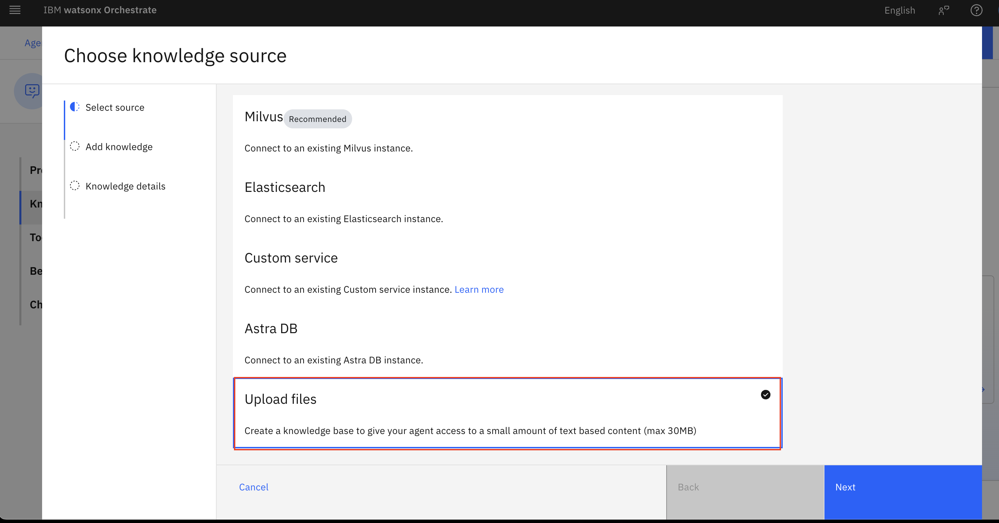
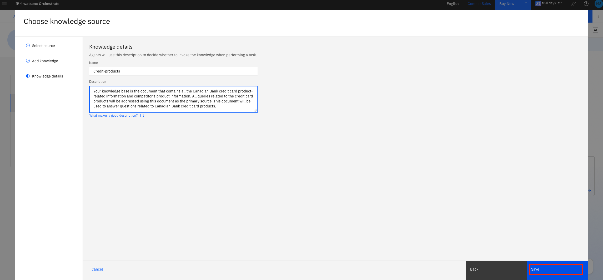
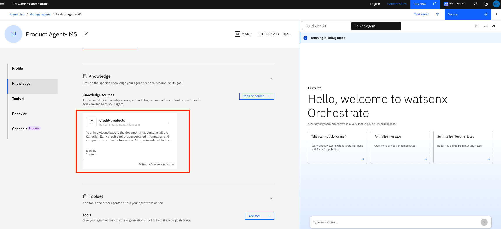
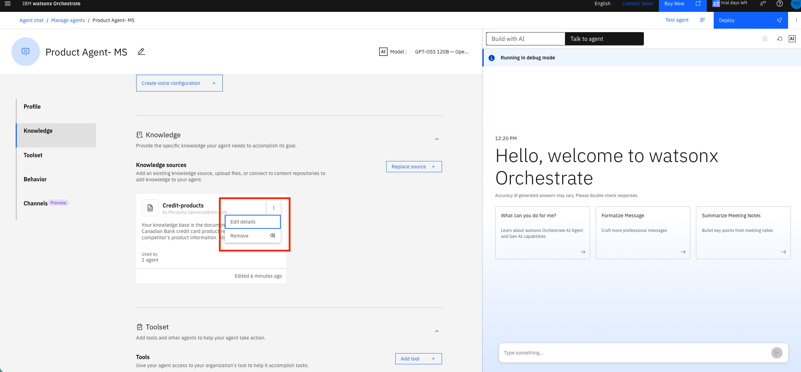
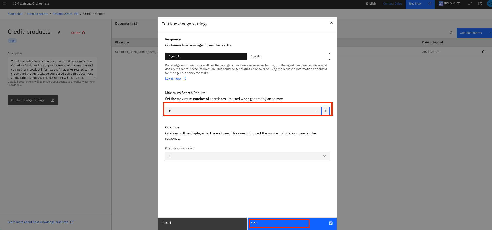
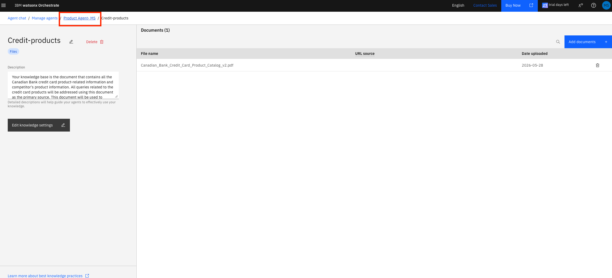
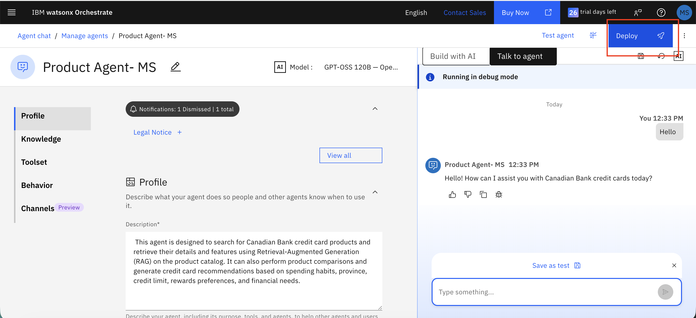

# Lab 1: Interac e-Transfer Support Agent with RAG and a Limits/Fees Tool (~50 min)

> **Interac watsonx Enablement Workshop.** Scenarios, personas, and data in this lab are fictional and for demonstration only.

> **About the screenshots:** the images show the watsonx Orchestrate UI, which is what matters for each step. A few screenshots were captured from an earlier build, so the agent, knowledge-base, or tool name shown in an image may differ from the text — **follow the text**, not the labels in the images.

> **Instructor has pre-provisioned:** the files below are available to participants, and everyone has watsonx Orchestrate access. The custom tool is built **inside** watsonx Orchestrate as a no-code Agentic workflow — there is **nothing to host or deploy**.

## Table of Contents
- [Architecture](#architecture)
- [Use Case Description](#use-case-description)
- [Pre-requisites](#pre-requisites)
- [Step-by-Step Instructions](#step-by-step-instructions)
  - [Part 1: Create the e-Transfer Agent](#part-1-create-the-e-transfer-agent-in-watsonx-orchestrate)
  - [Part 2: Add Knowledge Base (RAG)](#part-2-add-knowledge-base-rag)
  - [Part 3: Build the Limits/Fees Tool (Agentic Workflow)](#part-3-build-the-limitsfees-tool-agentic-workflow)
  - [Part 4: Production Agent Monitoring](#part-4-production-agent-monitoring)

## Architecture

The agent is built in watsonx Orchestrate and combines three capabilities: (1) a **Knowledge base (RAG)** over an Interac e-Transfer support guide, so the agent can answer how-to, policy, and security questions; (2) a **custom limits/fees tool built as a no-code Agentic workflow** that runs inside Orchestrate — it checks sending limits, calculates fees, and estimates delivery time by account tier (no external hosting); and (3) **agent evaluation and production monitoring** via watsonx Orchestrate and watsonx.governance.


## Use Case Description

A support team wants a smarter way to handle everyday Interac e-Transfer questions from customers. This lab builds an AI-powered **e-Transfer Support Agent** that:

1. **Uses RAG**: retrieves answers from an Interac e-Transfer support guide to explain how to send, request, and receive money, how Autodeposit works, delivery times, fees, and security best practices.
2. **Adds a limits/fees tool**: a no-code Agentic workflow that checks whether a transfer is within the customer's account-tier limits, calculates the applicable fee, and estimates delivery time.

This demonstrates knowledge-base integration, building a tool with the **no-code Agentic workflow builder**, and agent evaluation & production monitoring.

## Pre-requisites

- Access to an IBM watsonx Orchestrate instance
- Familiarity with AI agent concepts (instructions, tools, knowledge bases)
- Files provided in this lab folder: `Interac_eTransfer_Guide.pdf`, `etransfer-agent-test-cases.csv`

> No external service is required — the limits/fees tool is built inside Orchestrate in Part 3. *(An optional OpenAPI/FastAPI version of the same tool is included under `instructor/` for anyone who prefers a hosted API — not needed for this lab.)*

## Step-by-Step Instructions

### Part 1: Create the e-Transfer Agent in watsonx Orchestrate

#### 1.1 Access watsonx Orchestrate
1. Go to IBM Cloud (https://cloud.ibm.com) in the correct account.
2. **Resource list** → **AI / Machine Learning** → **watsonx Orchestrate** → **Launch watsonx Orchestrate**.
3. Click the hamburger menu (☰) and select **Build**.

   

#### 1.2 Create the Agent
1. Click **Create agent +** → **Create from scratch**.

   

2. Enter:
   - **Name**: `e-Transfer Support Agent-<your-initials>`
   - **Description**:
     ```
     This agent helps customers with Interac e-Transfer questions. It uses RAG over an e-Transfer support guide to explain how to send, request, and receive money, Autodeposit, delivery times, fees, and security best practices. It also uses a custom tool to check sending limits, calculate fees, and estimate delivery time by account tier.
     ```
   - **Instructions**:
     ```
     Always summarize tool outputs into clear, conversational responses. Never show raw JSON outputs to the user.
     ```

### Part 2: Add Knowledge Base (RAG)

#### 2.1 Upload the e-Transfer Guide
1. Click **Knowledge** section → **Add Source** → **New Knowledge**.


2. Select **Upload Files** → **Next**.

   

3. Drag and drop `Interac_eTransfer_Guide.pdf` (from this Lab 1 folder) into the upload area.

   

4. Click **Next** after the upload completes.

   

#### 2.2 Configure Knowledge Base
1. **Name**: `eTransfer-knowledge`
2. **Description**:
   ```
   Interac e-Transfer how-to and policy guide: how to send, request, and receive money; how Autodeposit works; security and fraud-awareness best practices; and troubleshooting / FAQs. Use this ONLY for explanatory "how does it work" questions. Do NOT use it for specific limit amounts, fees, or delivery estimates — those are calculated by the "eTransfer Limits & Fees" tool.
   ```
3. Click **Save**.

   

4. Verify the source appears, then click **Edit details**.

   
   

5. Click **Edit knowledge settings** → choose **Dynamic**, set **Maximum Search Results** to **10** → **Save**.


   

   > Indexing runs in the background — continue to Part 3 while it finishes.

6. Click the agent name at the top to return to the agent builder.

   

### Part 3: Build the Limits/Fees Tool (Agentic Workflow)

Instead of hosting an external service, we build the limits/fees logic as a **no-code Agentic workflow** that runs inside watsonx Orchestrate — nothing to deploy.

> All limits and fees below are **illustrative sample values** for the demo (they match the table in `Interac_eTransfer_Guide.pdf`).

#### 3.1 Start the workflow
1. Go to the **Tools** tab → **Add tool +**.

   

2. Under **Create**, choose **Agentic workflow** → **Start Building**.
   

3. Name it `eTransfer Limits & Fees` with the description:
   ```
   Calculates the exact Interac e-Transfer sending limit, fee, and estimated delivery time for a given account tier, and checks whether a specific amount is allowed. Use this for ANY question about limits, fees, how much can be sent, whether a specific dollar amount is allowed, or how long a transfer takes — these must be computed, not retrieved from the knowledge base. Requires account_tier, transfer_type, and amount.
   ```

#### 3.2 Define the inputs
Click **0 inputs** at the top of the flow, then click **Add** for each parameter (the agent fills these from the customer's question):


| Input | Type |
|-------|------|
| `transfer_type` | String |
| `amount` | Decimal |
| `account_tier` | String |
| `recipient_has_autodeposit` | Boolean |

> If the canvas started with a **Text extractor** node, delete it (we don't process documents) — select it and click the trash icon.

#### 3.3 Add the logic (Logic block)
From **Flow nodes → Logic block**, drop a **Logic block** between the start and end. Click **Open code editor** and paste:


```python
# Interac e-Transfer limits / fees / delivery — illustrative sample values for the demo
tiers = {
    "personal basic":   {"limit": 3000,  "fee": 0.00},
    "personal premium": {"limit": 5000,  "fee": 0.00},
    "small business":   {"limit": 25000, "fee": 1.50},
}

# Read the inputs (watsonx Orchestrate exposes them on `self`)
try:
    raw_account_tier = self.account_tier
except AttributeError:
    raw_account_tier = ""
try:
    raw_transfer_type = self.transfer_type
except AttributeError:
    raw_transfer_type = ""
try:
    raw_amount = self.amount
except AttributeError:
    raw_amount = 0
try:
    raw_autodeposit = self.recipient_has_autodeposit
except AttributeError:
    raw_autodeposit = False

# Normalize
tier = (raw_account_tier or "").strip().lower()
ttype = (raw_transfer_type or "").strip().lower()
if raw_amount is None:
    amount = 0
else:
    try:
        amount = float(raw_amount)
    except (ValueError, TypeError):
        amount = 0
recipient_has_autodeposit = bool(raw_autodeposit) if raw_autodeposit is not None else False

info = tiers.get(tier, {"limit": 0, "fee": 0.00})
per_transaction_limit = info["limit"]

# Requesting money is always free; otherwise use the tier's send fee
fee = 0.00 if ttype == "request money" else info["fee"]

# Within the per-transaction limit?
within_limit = amount <= per_transaction_limit

# Estimated delivery (Interac e-Transfers are near-instant)
if recipient_has_autodeposit:
    estimated_delivery = "Within seconds (Autodeposit)."
elif ttype == "request money":
    estimated_delivery = "Sent immediately; funds arrive after the other party approves."
else:
    estimated_delivery = "Typically within 30 minutes after the recipient accepts and answers the security question."

# Human-readable summary the agent can present directly
tier_label = tier.title() if tier in tiers else (raw_account_tier or "your account")
fee_text = "no fee" if fee == 0 else f"a ${fee:,.2f} fee"
if tier not in tiers:
    summary = (f"I don't recognize the account tier '{raw_account_tier}'. "
               f"Valid tiers are: Personal Basic, Personal Premium, or Small Business.")
elif within_limit:
    summary = (f"Yes - a ${amount:,.0f} transfer is within your {tier_label} "
               f"per-transaction limit of ${per_transaction_limit:,.0f}, with {fee_text}. "
               f"Estimated delivery: {estimated_delivery}")
else:
    summary = (f"A ${amount:,.0f} transfer exceeds your {tier_label} per-transaction limit "
               f"of ${per_transaction_limit:,.0f}. You could split it into smaller transfers "
               f"or move to a higher tier. If it were within limit, the fee would be {fee_text}.")

# Do NOT add a `return` statement. watsonx Orchestrate Logic blocks capture the
# output variables you declare in the Outputs tab by name (within_limit,
# per_transaction_limit, fee, estimated_delivery, summary). A `return` here
# throws "SyntaxError: 'return' outside function".
```

> ⚠️ **No `return` statement.** The Logic block is not a function — it captures the output variables by name. Adding `return {...}` fails with `SyntaxError: 'return' outside function`.

#### 3.4 Define the outputs
In the Logic block's **Outputs** tab, add these outputs — the names must match the keys in the code above:


| Output | Type |
|--------|------|
| `within_limit` | Boolean |
| `per_transaction_limit` | Integer |
| `fee` | Decimal |
| `estimated_delivery` | String |
| `summary` | String |

#### 3.5 Save and test
1. Click **Done** (top right) to save the workflow. It appears in the agent's **Toolset** as `eTransfer Limits & Fees` (if it isn't there, add it via **Tools → Add tool → Local instance**).
2. Flows can't be previewed on their own — test from the agent. In the agent's **chat preview**, ask e.g. *"I have a Personal Basic account, can I send $2,500 in one e-Transfer, and is there a fee?"* and confirm the agent calls the tool and returns the correct limit/fee.


> The exact node names in the flow builder can vary by version — use the **Decision/branch** steps for the tier logic and a final **response / set-output** step. Confirm labels in your environment.

#### 3.6 Configure Agent Behavior
Scroll to the **Behavior** section and add these instructions:

   


   ```
You are an Interac e-Transfer support assistant. You operate exclusively within the Interac e-Transfer domain. Be clear, concise, and friendly.

1. e-Transfer Information & Knowledge Base
For how e-Transfer works — sending, requesting, or receiving money, how Autodeposit works, security, or troubleshooting — retrieve answers from the eTransfer-knowledge knowledge base. Use it ONLY for how-it-works, policy, security, and troubleshooting — never for specific limit amounts, fees, or delivery times.

2. Limits, Fees, and Delivery (Tool)
When a customer asks whether a transfer is allowed, how much it costs, or how long it takes, you MUST use the "eTransfer Limits & Fees" workflow — never quote a limit, fee, or delivery time from the knowledge base or from memory. Call it with:
- transfer_type: "send money", "request money", or "autodeposit"
- amount: transfer amount in CAD
- account_tier: "personal basic", "personal premium", or "small business"
- recipient_has_autodeposit: yes or no (optional; default no)
If the account tier or amount is missing, ask for it before calling the tool.

Presenting the result — NEVER show the raw JSON the tool returns. Turn it into a friendly reply: one sentence answering the question, then a compact markdown table. Example, for a $4,000 Small Business send that returns within_limit=true, per_transaction_limit=25000, fee=1.50, estimated_delivery="Typically within 30 minutes":

Yes — a $4,000 e-Transfer is within your Small Business limit.

| Detail | Value |
|---|---|
| Amount | $4,000 CAD |
| Account tier | Small Business |
| Within limit? | Yes (limit $25,000 per transaction) |
| Fee | $1.50 |
| Estimated delivery | Typically within 30 minutes |

If within_limit is false, say so clearly and suggest splitting the transfer or upgrading the tier.

3. Fraud Awareness
If a customer is asked to send an e-Transfer to "verify", "protect", or "move" their money, warn them it's a common scam, tell them not to send it, and to contact their financial institution. Never encourage sending money to unknown recipients.

Standards: all amounts in CAD; only answer within the Interac e-Transfer domain; if out of scope, politely say so.
```


### Part 4: Production Agent Monitoring

#### 4.1 Deploy the agent
1. Click **Deploy** → **Deploy to Live**. (Feel free to add some welcome message and starter prompts for users to quickly understand this agent)

   
   


2. Click **Create New Version**.

   


3. Return to the watsonx Orchestrate home (logo, top-left), then pick your deployed **e-Transfer Support Agent-<your-initials>** from the dropdown.

   


4. Ask a few questions to the deployed agent so monitoring has data (mix knowledge, tool, and a fraud scenario), e.g.:

   ```
   How do I send an Interac e-Transfer?
   ```
   ```
   What is the per-transaction sending limit for a Personal Basic account?
   ```
   ```
   I have a Personal Premium account and want to send $8,000 in one transfer. Is that allowed?
   ```

#### 4.2 View the monitoring dashboard
After deploying and asking a few questions, click the **watsonx Orchestrate** logo (top-left) to return to the home page. You now land on a monitoring dashboard that summarizes every agent you've deployed.

   


The header shows how many **live agents** you have and how many **users** engaged them in the last 30 days. Use the **24h / 7d** toggle (top right) to change the time window, and the tabs across the top to switch views:

- **Overview** — at-a-glance health: message volume, user feedback, deployment status, evaluation status, and a **Needs attention** panel flagging things like agents with no test cases or no recent conversations.
- **Adoption** — how much the agents are actually being used (active users, conversation counts, inactive agents).
- **FinOps** — cost view: token usage and spend per agent.
- **Quality** — answer-quality and evaluation metrics.
- **Reliability** — failures, errors, and response times.
- **Security and Risk** — governance, credential, and risk signals.

For this lab, stay on **Overview** and point out the **Deployment status** (your agent is now *Live*) and the **Needs attention** list — a quick, business-friendly way to see how a deployed agent is performing without digging into individual traces.

---

## Conclusion

**Congratulations!** You built, deployed, and monitored an **Interac e-Transfer Support Agent** in watsonx Orchestrate — combining RAG for support knowledge with a limits/fees tool built using the no-code Agentic workflow builder.
