# Lab 1: WXO Agent Governance — Interac e-Transfer Support Agent with RAG and a Limits/Fees Tool

> **Interac watsonx Enablement Workshop.** Scenarios, personas, and data in this lab are fictional and for demonstration only.

> **About the screenshots:** the images show the watsonx Orchestrate UI, which is what matters for each step. A few screenshots were captured from an earlier build, so the agent name, knowledge-base name, or tool name shown in an image may differ from the text — **follow the text**, not the labels in the images.

## Table of Contents
- [Architecture](#architecture)
- [Use Case Description](#use-case-description)
- [Pre-requisites](#pre-requisites)
- [Step-by-Step Instructions](#step-by-step-instructions)
  - [Part 1: Create the e-Transfer Agent in watsonx Orchestrate](#part-1-create-the-e-transfer-agent-in-watsonx-orchestrate)
  - [Part 2: Add Knowledge Base (RAG)](#part-2-add-knowledge-base-rag)
  - [Part 3: Import the e-Transfer Tool](#part-3-import-the-e-transfer-tool)
  - [Part 4: Pre-production Agent Testing](#part-4-pre-production-agent-testing)
  - [Part 5: Production Agent Monitoring](#part-5-production-agent-monitoring)

## Architecture

The agent is built in watsonx Orchestrate and combines three capabilities: (1) a **Knowledge base (RAG)** over an Interac e-Transfer support guide, so the agent can answer how-to, policy, and security questions; (2) a **custom e-Transfer tool** (an OpenAPI/FastAPI service) that checks sending limits, calculates fees, and estimates delivery time by account tier; and (3) **agent evaluation and production monitoring** via watsonx Orchestrate and watsonx.governance.

## Use Case Description

A support team wants a smarter way to handle everyday Interac e-Transfer questions from customers. This lab builds an AI-powered **e-Transfer Support Agent** that:

1. **Uses RAG**: retrieves answers from an Interac e-Transfer support guide to explain how to send, request, and receive money, how Autodeposit works, delivery times, fees, and security best practices.

2. **Adds a limits/fees tool**: integrates a custom tool that checks whether a transfer is within the customer's account-tier limits, calculates the applicable fee, and estimates delivery time.

This approach demonstrates:
- Knowledge base integration for support content
- Custom tool integration
- Agent evaluation and production monitoring

## Pre-requisites

- Access to an IBM watsonx Orchestrate instance
- Familiarity with AI agent concepts (instructions, tools, knowledge bases)
- Basic understanding of REST APIs and OpenAPI specifications
- Files provided in this lab folder:
  - `Interac_eTransfer_Guide.pdf` (knowledge-base source)
  - `instructor/etransfer_tool.json` (OpenAPI spec for the custom tool)
  - `etransfer-agent-test-cases.csv` (test cases for evaluation)

> The custom tool must be running and reachable before Part 3. See `instructor/README.md` for how to run and host the FastAPI service, then set the server URL in `etransfer_tool.json`.

## Step-by-Step Instructions

### Part 1: Create the e-Transfer Agent in watsonx Orchestrate

#### 1.1 Access watsonx Orchestrate

1. Go to IBM Cloud (https://cloud.ibm.com) and ensure you're in the correct account.

2. Navigate to **Resource list** → **AI / Machine Learning** → **watsonx Orchestrate**.

3. Click **Launch watsonx Orchestrate**.

4. Click the hamburger menu (☰) and select **Build**.

   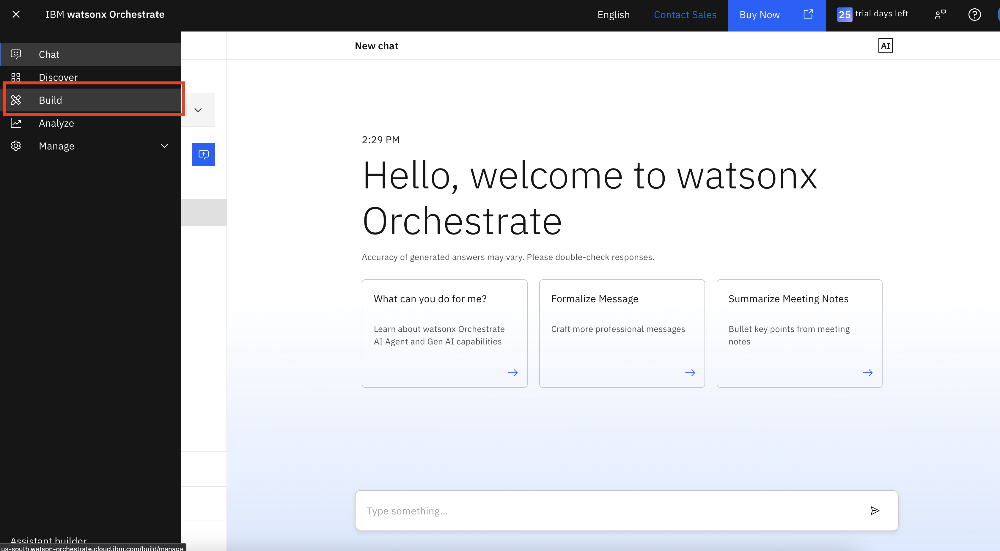

#### 1.2 Create the Agent

1. Click **Create agent +**.

   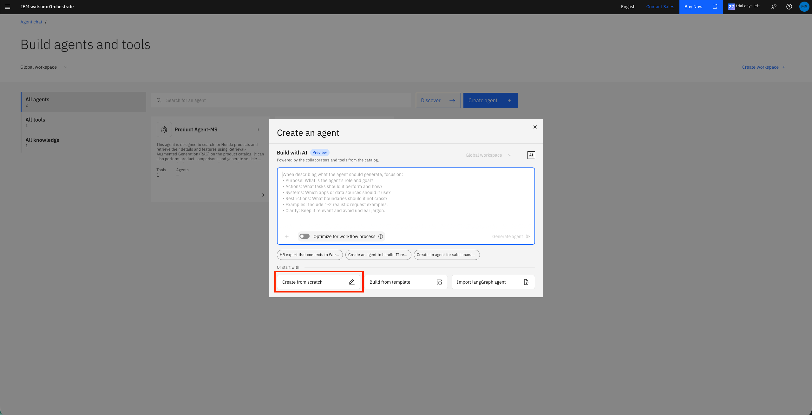

2. Select **Create from scratch**.

3. Enter the following details:
   - **Name**: `e-Transfer Support Agent-<your-initials>` — add your initials to keep the name unique.
   - **Description**:
     ```
     This agent helps customers with Interac e-Transfer questions. It uses Retrieval-Augmented Generation (RAG) over an e-Transfer support guide to explain how to send, request, and receive money, how Autodeposit works, delivery times, fees, and security best practices. It also uses a custom tool to check sending limits, calculate fees, and estimate delivery time by account tier.
     ```

4. Click **Create**.

   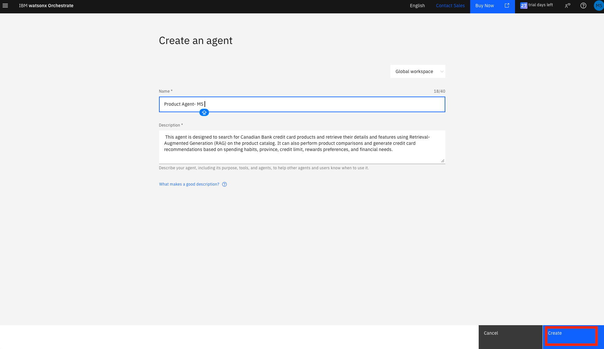

### Part 2: Add Knowledge Base (RAG)

#### 2.1 Upload the e-Transfer Guide

1. Scroll down to the **Knowledge** section.

2. Click **Add Source** → **New Knowledge**.

   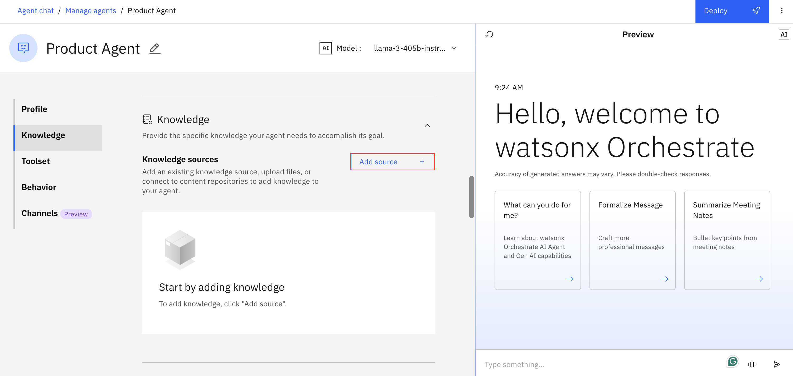

3. Select **Upload Files** → click **Next**.

   

4. Download `Interac_eTransfer_Guide.pdf` from this Lab 1 folder.

5. Drag and drop the file into the upload area.

   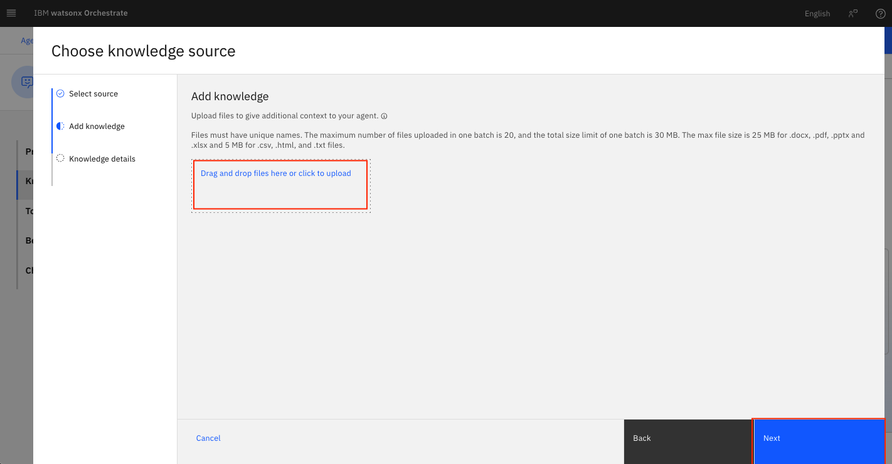

6. Click **Next** after the upload completes.

   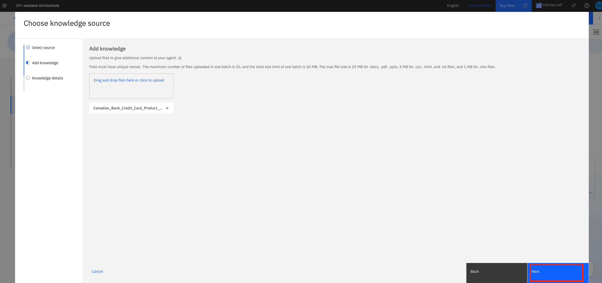

#### 2.2 Configure Knowledge Base

1. **Name**: `eTransfer-knowledge`

2. **Description**:
   ```
   This knowledge base contains the Interac e-Transfer support guide, covering how to send, request, and receive money, Autodeposit, sending limits by account tier, fees, delivery times, security best practices, and frequently asked questions. All customer questions about e-Transfer should be answered using this document as the primary source.
   ```

3. Click **Save**.

   

4. Verify the knowledge source appears in the Knowledge section.

   

5. Click the **Edit details** button.

   

6. Click **Edit knowledge settings**.

   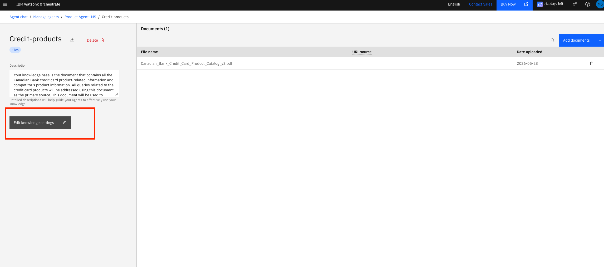

7. Choose **Dynamic**, set **Maximum Search Results** to 10, and click **Save**.

   

8. Click the agent name at the top to go back to the agent builder.

   

### Part 3: Import the e-Transfer Tool

> **Before you start:** the FastAPI service in `instructor/` must be running and reachable at a public URL, and `instructor/etransfer_tool.json` must have `servers[0].url` set to that URL. See `instructor/README.md`.

#### 3.1 Import Tool via UI

1. Scroll down to the **Toolset** section in your agent configuration.

2. Click **Add tool +**.

   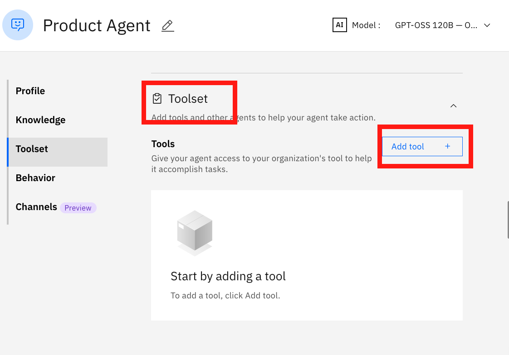

3. Select **Import** → **OpenAPI**.

   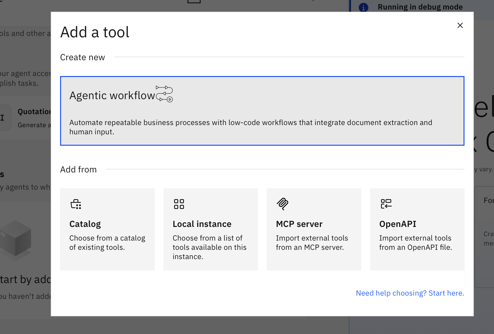

4. Upload the `instructor/etransfer_tool.json` file. Select the **Etransfer Tool** operation (`POST /etransfer_tool`) and click **Add to agent**. You do **not** need to import the `Root` or `Get Tiers` operations.

   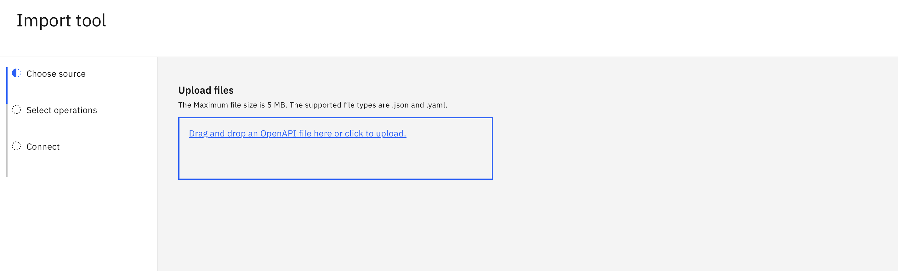

5. Verify the tool appears in the Toolset section.

   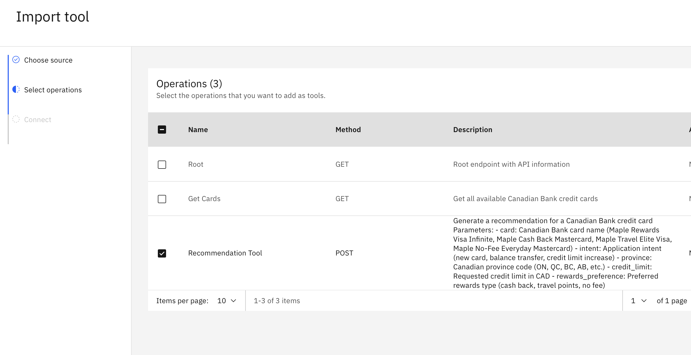

   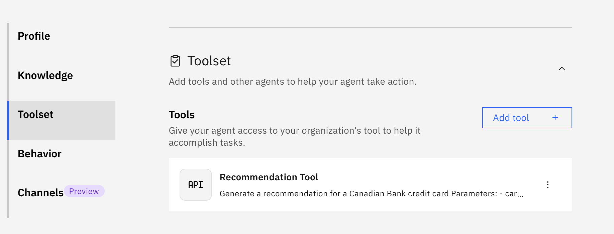

#### 3.2 Configure Agent Behavior

Scroll down to the **Behavior** section and add the following instructions:

   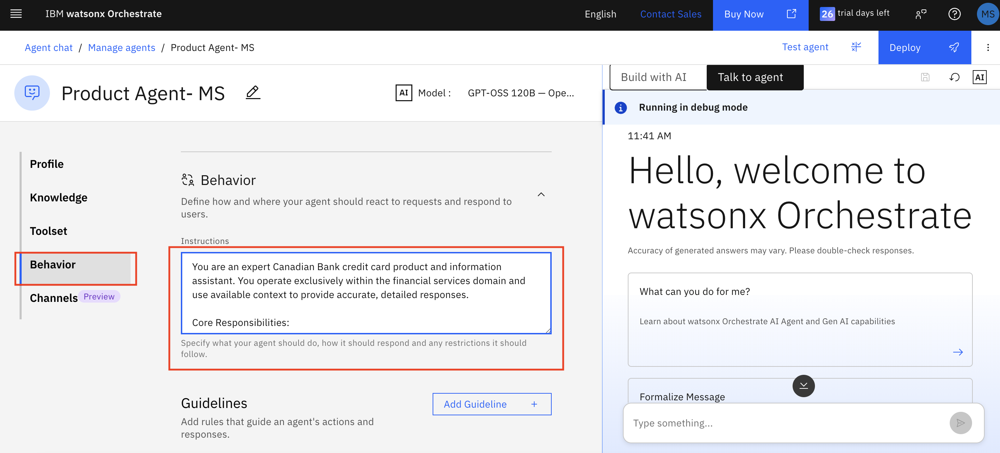

   ```
You are an Interac e-Transfer support assistant. You operate exclusively within the Interac e-Transfer domain and use the available context to provide accurate, helpful responses. Be clear, concise, and friendly.

Core Responsibilities:

1. e-Transfer Information & Knowledge Base
When customers ask how e-Transfer works — sending, requesting, or receiving money, Autodeposit, delivery times, fees, security, or troubleshooting — retrieve answers from the eTransfer-knowledge knowledge base. Provide accurate, step-by-step guidance.

2. Limits, Fees, and Delivery (Tool)
When a customer asks whether a transfer is allowed, how much a transfer will cost, or how long it will take, use the etransfer_tool to get an accurate answer.

Required Parameters:
- transfer_type: "send money", "request money", or "autodeposit"
- amount: transfer amount in CAD
- account_tier: "personal basic", "personal premium", or "small business"
- recipient_has_autodeposit: true or false (optional; default false)

If the customer has not provided the account tier or amount, ask for it before calling the tool.

Response Format for tool results:
Present results in a clear markdown table showing:
- Transfer type
- Amount (in CAD)
- Account tier
- Within limit (Yes/No)
- Per-transaction limit (in CAD)
- Fee (in CAD)
- Estimated delivery

If the transfer exceeds the per-transaction limit, explain the limit and suggest splitting the transfer or contacting the financial institution about a higher tier.

3. Fraud Awareness
If a customer describes being asked to send an e-Transfer to "verify", "protect", or "move" their money, warn them that this is a common scam, advise them not to send it, and tell them to contact their financial institution. Never encourage sending money to unknown recipients.

Standards:
- All amounts in Canadian Dollars (CAD).
- Only answer questions within the Interac e-Transfer domain. If a question is out of scope, politely say so.
```

### Part 4: Pre-production Agent Testing

Now we will test the agent with multiple test cases.

Testing helps confirm that recent changes to the tool, collaborators, or knowledge produce the expected responses. You can iterate faster by running only relevant cases for small updates and full evaluations when validating end-to-end behavior.

Here are some example questions:

- **Basic how-to question (knowledge base):**
  ```
  How do I send an Interac e-Transfer?
  ```

- **Limits/fees question (tool):**
  ```
  I have a Personal Basic account. Can I send $2,500 in one e-Transfer, and is there a fee?
  ```

- **Combined knowledge + tool:**
  ```
  What is Autodeposit, and if I have a Small Business account can I send $20,000 in one transfer with Autodeposit enabled for the recipient?
  ```

You can test the agent with the questions one by one in chat preview. However, it is more efficient to use the Test feature, which runs multiple prompts automatically and provides results and scores for different metrics.

To evaluate the agent's output, we provide the question (prompt) and the expected output in a CSV format (`etransfer-agent-test-cases.csv`).

#### 4.1 Upload test cases

1. After completing a prompt, click the **Save as test** button.

   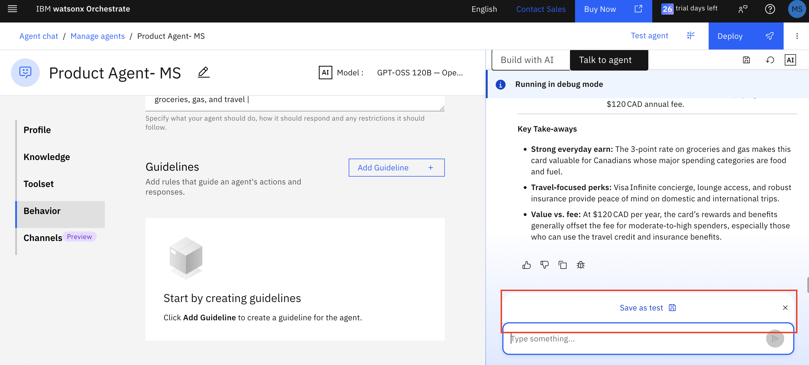

2. Once you save the test case, click **Test Agent** at the top right of the screen.

   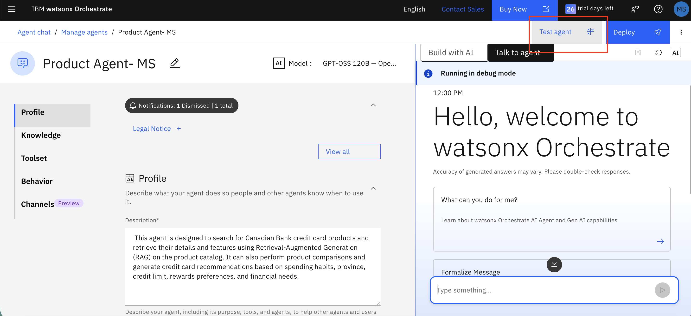

3. In the **Test cases** tab, click **Evaluate All** to run all the test cases.

   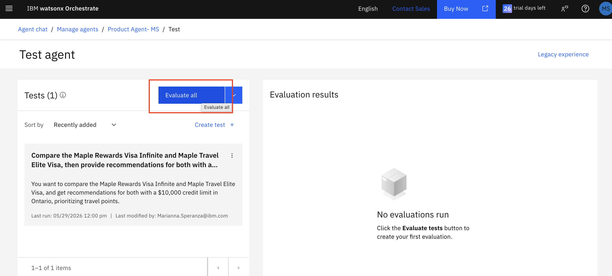

#### 4.2 Review Testing Results

1. It takes some time to run all the test cases. Once complete, click the view icon to see the result details.

   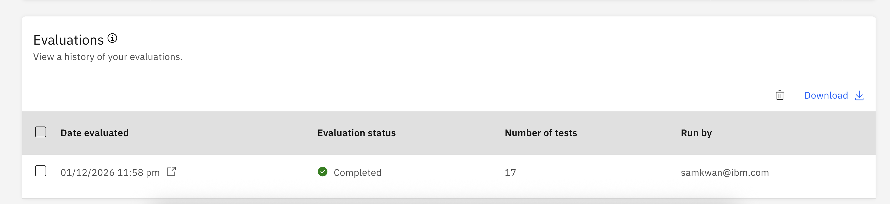

2. Review the evaluation results calculated by watsonx Orchestrate, including answer-quality metrics, message completion, etc.

   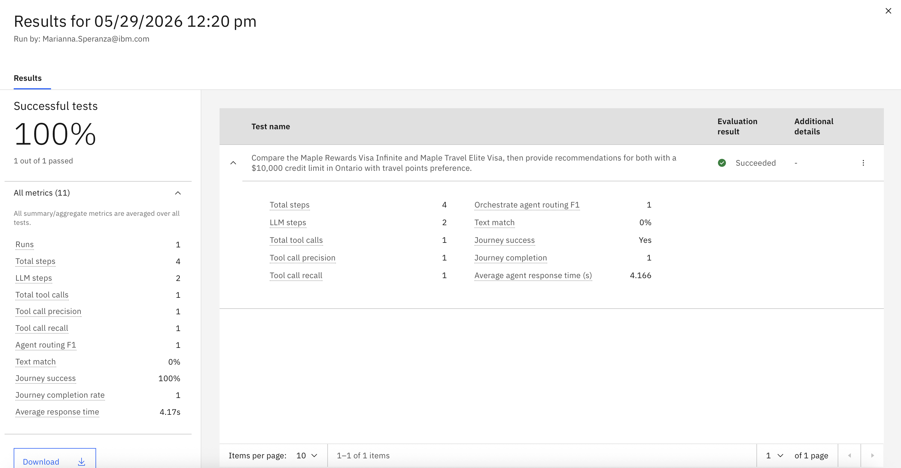

3. You can also click the download button to download the results in CSV format.

To understand the test results, review the [watsonx Orchestrate documentation](https://www.ibm.com/docs/en/watsonx/watson-orchestrate/base?topic=agents-testing-evaluating-draft-agent#analyzing-evaluation-metrics).

### Part 5: Production Agent Monitoring

#### 5.1 Deploy the agent

1. Go back to the agent builder. Click the **Deploy** button and click **Deploy** to deploy the agent.

   

   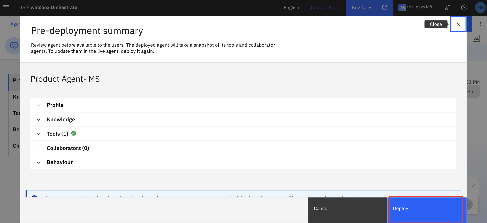

2. Once the agent is deployed, it will ask if you want to **Activate agent monitoring**. Click **Activate agent monitoring** to proceed.

   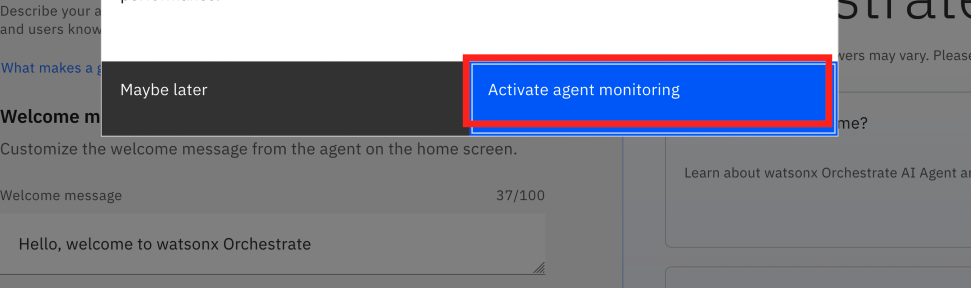

3. Go back to the watsonx Orchestrate home page by clicking the watsonx Orchestrate logo in the top-left corner.

   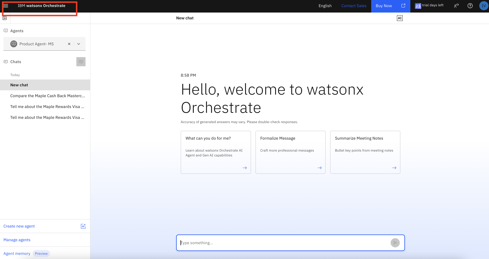

   Click the dropdown list for the deployed agents.

   **Make sure you select the e-Transfer Support Agent with your initials (e.g. e-Transfer Support Agent-<your-initials>).**

   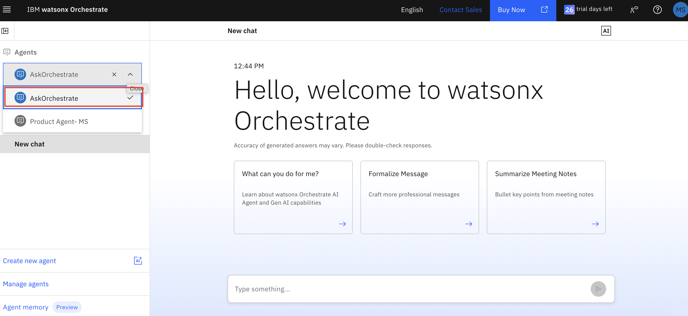

4. Now ask a few of the questions below to the deployed production agent, so you can see how watsonx Orchestrate monitors the agent's responses. Pick at least 5.

- **Basic e-Transfer Information**
  ```
  How do I send an Interac e-Transfer?
  ```
  ```
  What is Autodeposit and why should I use it?
  ```
  ```
  How long does an e-Transfer take to arrive?
  ```
  ```
  Is there a fee to receive money by e-Transfer?
  ```
  ```
  Can I cancel an e-Transfer after I send it?
  ```

- **Limits & Fees (tool)**
  ```
  What is the per-transaction sending limit for a Personal Basic account?
  ```
  ```
  I have a Personal Premium account and want to send $8,000 in one transfer. Is that allowed?
  ```
  ```
  I have a Small Business account. Can I send $20,000 in one e-Transfer, and is there a fee?
  ```

- **Security & Fraud**
  ```
  Someone asked me to send an e-Transfer to verify my account. Is that legitimate?
  ```
  ```
  What are some best practices to keep my e-Transfers safe?
  ```

- **Complex / Multi-Step**
  ```
  Explain how Autodeposit works, then tell me if a Personal Premium account can send $4,500 to a recipient who has Autodeposit enabled, including the fee and delivery time.
  ```
  ```
  What happens if the recipient never accepts my transfer, and how do I increase my limits?
  ```

#### 5.2 WXO Analyze with watsonx.governance

1. Click the hamburger menu in the top left and select **Analyze**.

   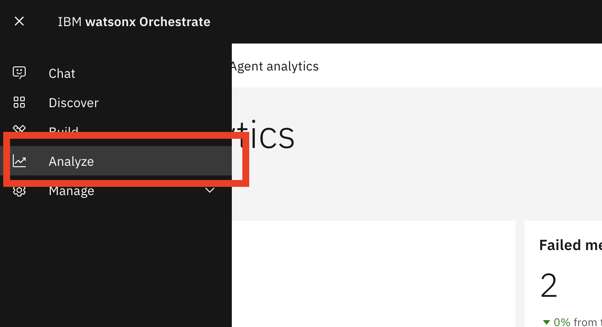

2. Here is the overview of all the WXO agents' performance, with each agent listed individually.

These metrics help you:

- Detect spikes in failed messages that might indicate errors or broken logic.
- Monitor response times to identify performance slowdowns.
- Track message volume to confirm that the agents are active and functioning.
- Track the performance analysis and safety checks of live agents.

   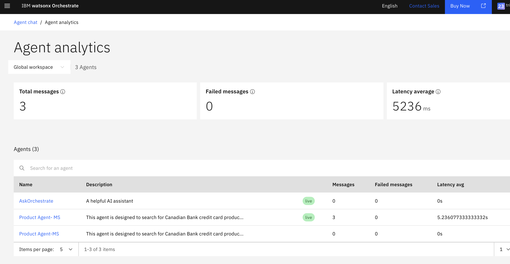

3. Click on the e-Transfer Support Agent to see the individual conversation trace.
   **Make sure you select the deployed agent with your initials (e.g. e-Transfer Support Agent-<your-initials>).**

   It shows the total messages from today, any failed messages, and the average latency for the agent to answer a query.

   There is also a date button in the top-right corner so you can switch back to past dates.

   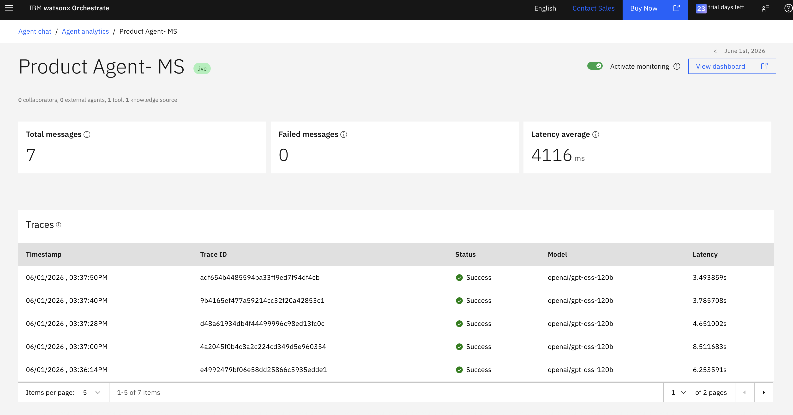

4. Click the first trace from the Traces list.

   Here you can view the entire conversation history to understand what the user and the agent said at each step.

   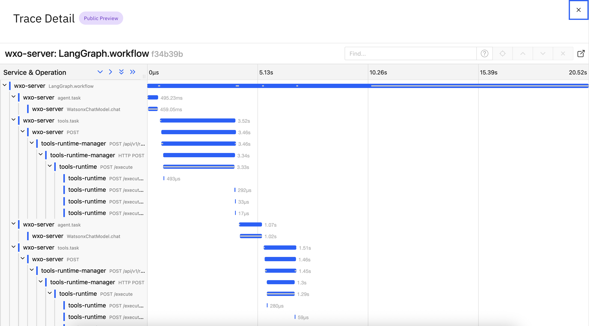

   You can use **Trace Details** to:
   - Debug **tool execution** (inputs, outputs, latency)
   - Validate **knowledge / RAG behavior** (search, model, response)
   - Identify whether issues come from **connectivity, logic, or data**

   In this lab, you can focus on:
   1. Debugging tool flow runtime issues
   2. Debugging knowledge runtime issues

##### 1. Debugging Tool Flow Runtime Issues

The **Trace Details** view separates **LLM reasoning** from **tool execution**, allowing you to:

- Understand the full flow from **LLM decision → tool invocation → execution**
- Correlate **tool outcomes** with the agent's decision-making
- Validate **flow logic and dependencies** in real runtime context
- Identify **latency issues, failures, and performance bottlenecks**

**Actual Tool Execution**

1. **Network Trip Start (`wxo-server`)**

   Expand **wxo-server LangGraph workflow**, scroll down to **Tags**, and search for **traceloop.entity.output**.

   - Indicates the start of a network request from **wxo-server**
   - Captures runtime details: the input prompt, the reasoning about which tool to call, the tool input payload, the tool output, and token usage
   - Useful for correlating **LLM intent** with **tool invocation** (for example, confirming the agent called `etransfer_tool` with the right `account_tier` and `amount`)

   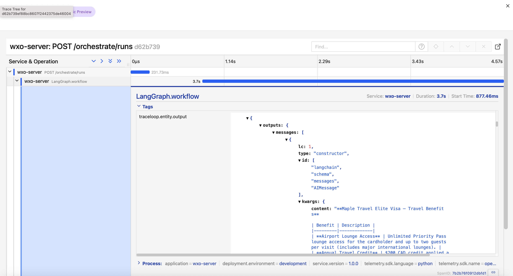

##### 2. Debugging Knowledge Runtime Issues

Debug-level trace details provide deep visibility into an agent's **knowledge (RAG) workflow**. They help diagnose **missing, incorrect, or incomplete responses** by exposing what happens at each stage of message processing.

Use debug-level trace data to:

- Review **requests and responses** during the **retrieval phase**
- Examine **inputs and outputs** during **answer generation**
- Assess **post-processing status**, latency, and performance metrics

**Accessing Debug-Level Trace Details**

For an agent with **knowledge enabled**:

1. Go to **Service & Operations**
2. Navigate to **`wxo-server → tools.task → Tags`**
3. Scroll to **`traceloop.entity.output`**
4. Expand **`artifact → debug`**

   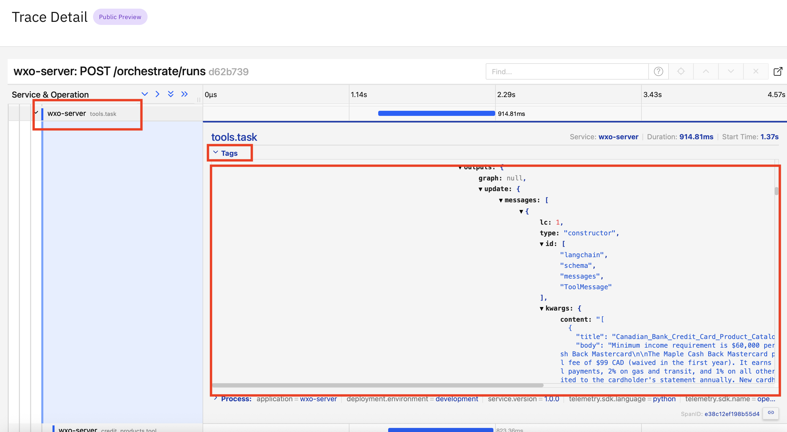
   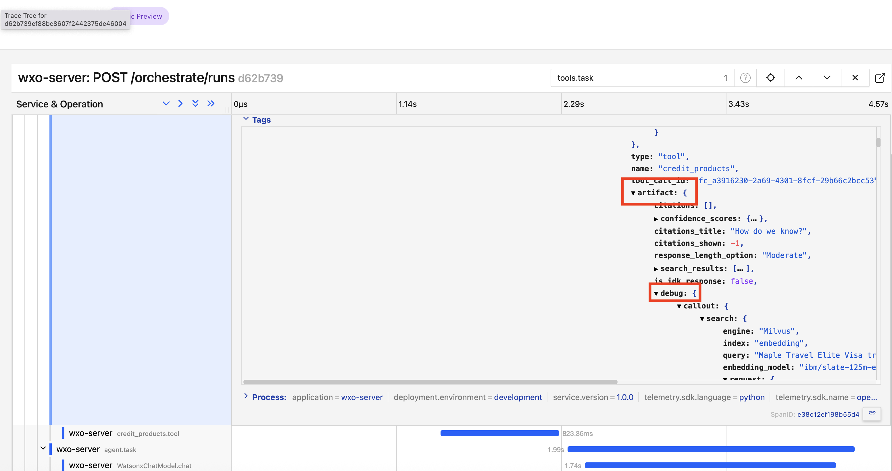

**Key Runtime Fields** (you can use Ctrl+F to search for these keywords):

1. **Callout**

   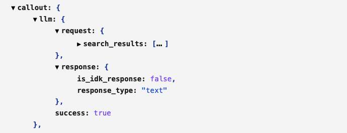

   - `llm`: **input_token_count**, **generated_token_count**, **model_id**
   - `request`: **search_results** returned from the knowledge retrieval step
   - `response`: **is_idk_response** (whether the assistant returned an "I don't know"), **response_type**, **text**
   - `success`: whether the response was delivered successfully

2. **Search**

   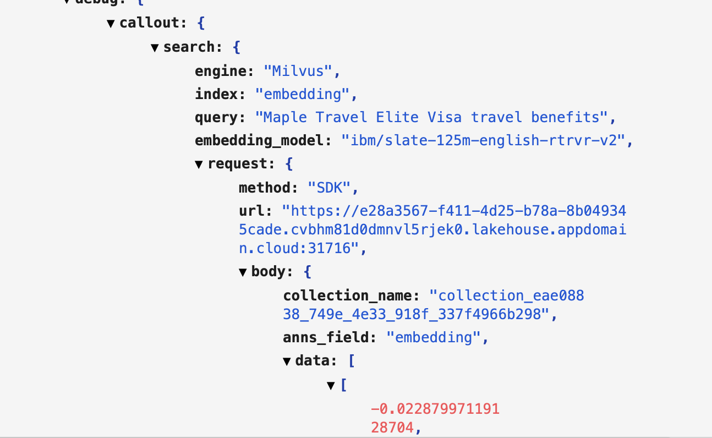

   - **engine**, **index**, **query** issued by the agent
   - `request`: **body**, **method**, **path**, **port**, **url**
   - `response`: **body** (retrieved documents)

3. **Metrics**

   - **search_time_ms**, **answer_generation_time_ms**, **total_time_ms**

   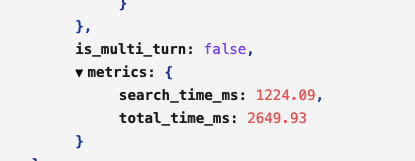

If the agent confidently answered the wrong thing — or politely said "I don't know" when it shouldn't — this is where the truth lives.

---

#### 5.3 View watsonx.governance Dashboard

1. Click the **View dashboard** button at the top right corner.
   **Make sure you select the deployed agent with your initials.**

   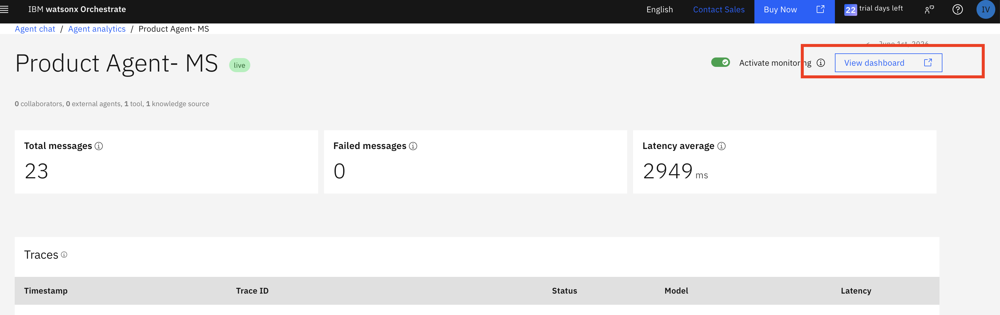

2. You will be navigated to the **watsonx.governance** dashboard.

   Review the **Evaluation** tab to see more information about the conversations, messages, and tools used by the agent. Alerts show you metrics that are outside their threshold values.

   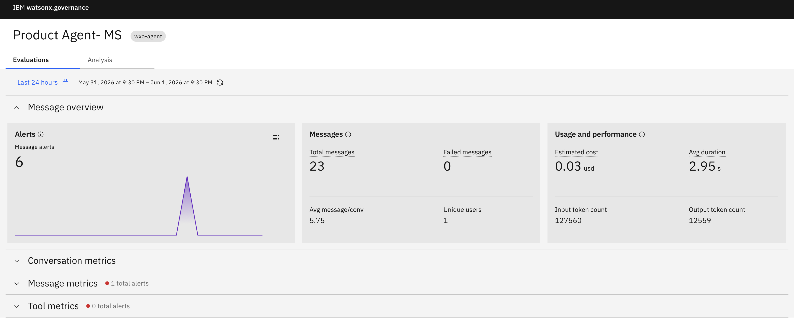

3. Move your mouse over the Alerts dashboard and click on the latest timestamp at which you tested the agent.

   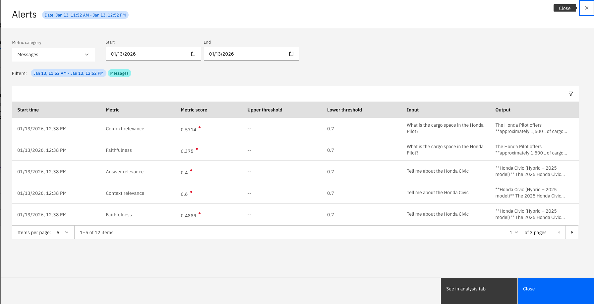

4. You can review metrics like cost, input tokens, and output tokens at three levels:
   - Conversation level
   - Message level
   - Tool level

   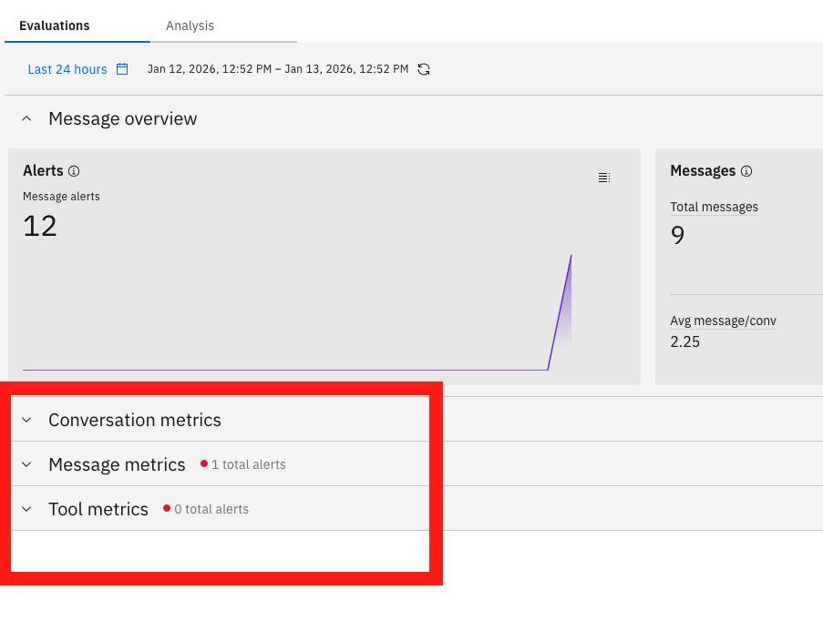

5. To understand the metrics and how they are calculated, see the [watsonx Orchestrate Agent Monitoring Metrics](https://dataplatform.cloud.ibm.com/docs/content/wsj/model/wos-eval-agents.html?context=wx#metrics-for-agent-monitoring) documentation.

6. When you want to see greater detail, click the **Analysis** tab. You can analyze the distribution of conversation metrics, view the conversations for a time period, and explore the individual messages within a conversation.

   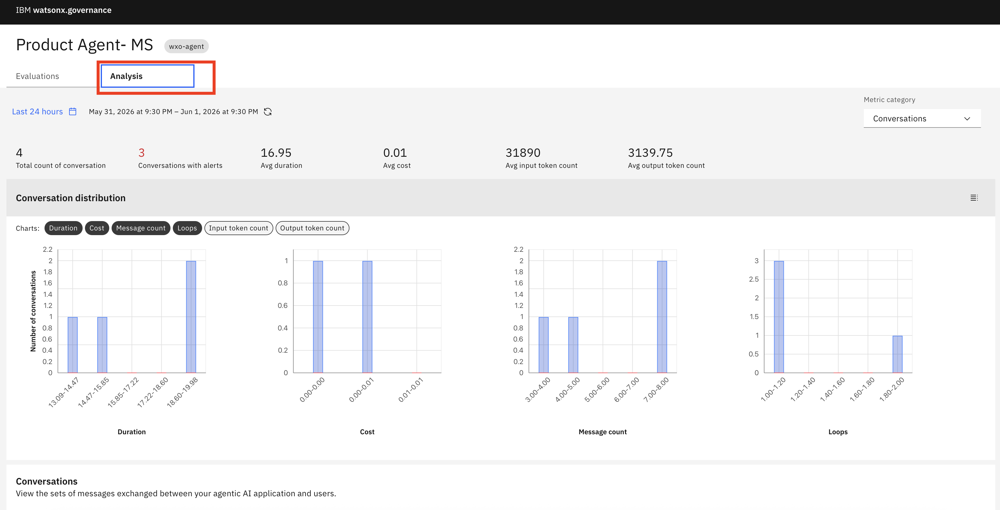

7. In the **Conversation** table, click the 3 dots and click **View details**.

   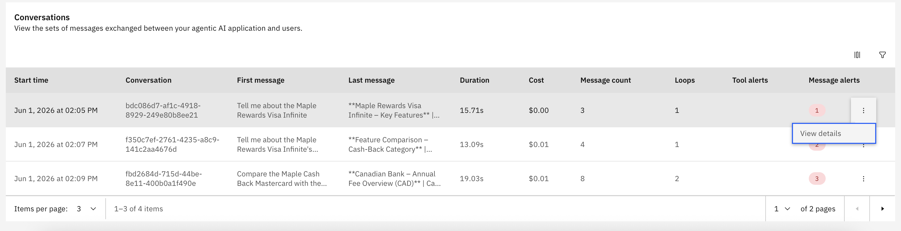

8. Here you can review the whole conversation (chat session) and see the metrics for each message.

   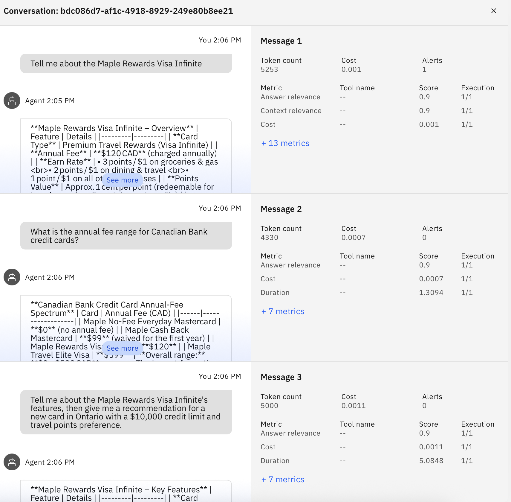

---

## Conclusion

**Congratulations!**
This lab guided you through the complete process of building and deploying an **Interac e-Transfer Support Agent** using watsonx Orchestrate, with a focus on agent governance and monitoring. You combined Retrieval-Augmented Generation (RAG) for support knowledge with a custom limits/fees tool — but the primary takeaway is how to **evaluate, monitor, and govern** AI agent performance in production, ensuring your agent operates reliably, transparently, and in alignment with business goals.
