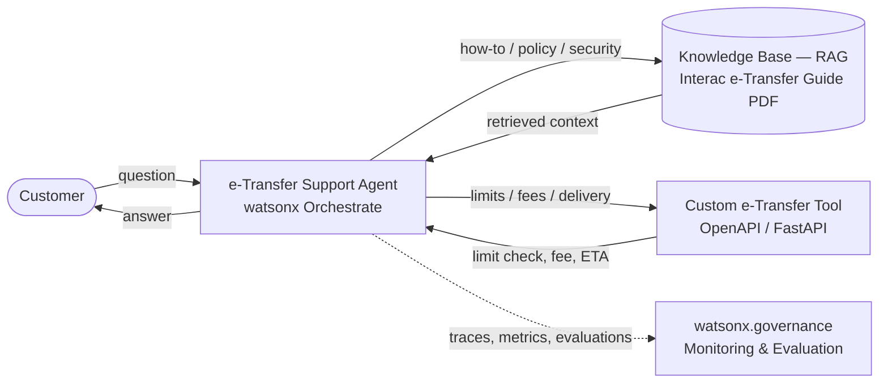

# Lab 1: Interac e-Transfer Support Agent with RAG and a Limits/Fees Tool (~50 min)

> **Interac watsonx Enablement Workshop.** Scenarios, personas, and data in this lab are fictional and for demonstration only.

> **About the screenshots:** the images show the watsonx Orchestrate UI, which is what matters for each step. A few screenshots were captured from an earlier build, so the agent, knowledge-base, or tool name shown in an image may differ from the text — **follow the text**, not the labels in the images.

> **Instructor has pre-provisioned:** the e-Transfer tool service is deployed and its URL is already set in `instructor/etransfer_tool.json`; the files below are provided to you; you have watsonx Orchestrate access. This lets the lab fit ~50 minutes.

## Table of Contents
- [Architecture](#architecture)
- [Use Case Description](#use-case-description)
- [Pre-requisites](#pre-requisites)
- [Step-by-Step Instructions](#step-by-step-instructions)
  - [Part 1: Create the e-Transfer Agent](#part-1-create-the-e-transfer-agent-in-watsonx-orchestrate)
  - [Part 2: Add Knowledge Base (RAG)](#part-2-add-knowledge-base-rag)
  - [Part 3: Import the e-Transfer Tool](#part-3-import-the-e-transfer-tool)
  - [Part 4: Pre-production Agent Testing](#part-4-pre-production-agent-testing)
  - [Part 5: Production Agent Monitoring](#part-5-production-agent-monitoring)

## Architecture

The agent is built in watsonx Orchestrate and combines three capabilities: (1) a **Knowledge base (RAG)** over an Interac e-Transfer support guide, so the agent can answer how-to, policy, and security questions; (2) a **custom e-Transfer tool** (an OpenAPI/FastAPI service) that checks sending limits, calculates fees, and estimates delivery time by account tier; and (3) **agent evaluation and production monitoring** via watsonx Orchestrate and watsonx.governance.



## Use Case Description

A support team wants a smarter way to handle everyday Interac e-Transfer questions from customers. This lab builds an AI-powered **e-Transfer Support Agent** that:

1. **Uses RAG**: retrieves answers from an Interac e-Transfer support guide to explain how to send, request, and receive money, how Autodeposit works, delivery times, fees, and security best practices.
2. **Adds a limits/fees tool**: a custom tool that checks whether a transfer is within the customer's account-tier limits, calculates the applicable fee, and estimates delivery time.

This demonstrates knowledge-base integration, custom-tool integration, and agent evaluation & production monitoring.

## Pre-requisites

- Access to an IBM watsonx Orchestrate instance
- Familiarity with AI agent concepts (instructions, tools, knowledge bases)
- Files provided in this lab folder: `Interac_eTransfer_Guide.pdf`, `instructor/etransfer_tool.json`, `etransfer-agent-test-cases.csv`

## Step-by-Step Instructions

### Part 1: Create the e-Transfer Agent in watsonx Orchestrate

#### 1.1 Access watsonx Orchestrate
1. Go to IBM Cloud (https://cloud.ibm.com) in the correct account.
2. **Resource list** → **AI / Machine Learning** → **watsonx Orchestrate** → **Launch watsonx Orchestrate**.
3. Click the hamburger menu (☰) and select **Build**.

   

#### 1.2 Create the Agent
1. Click **Create agent +** → **Create from scratch**.

   

2. Enter:
   - **Name**: `e-Transfer Support Agent-<your-initials>`
   - **Description**:
     ```
     This agent helps customers with Interac e-Transfer questions. It uses RAG over an e-Transfer support guide to explain how to send, request, and receive money, Autodeposit, delivery times, fees, and security best practices. It also uses a custom tool to check sending limits, calculate fees, and estimate delivery time by account tier.
     ```

### Part 2: Add Knowledge Base (RAG)

#### 2.1 Upload the e-Transfer Guide
1. Click **Knowledge** section → **Add Source** → **New Knowledge**.


2. Select **Upload Files** → **Next**.

   

3. Drag and drop `Interac_eTransfer_Guide.pdf` (from this Lab 1 folder) into the upload area.

   

4. Click **Next** after the upload completes.

   

#### 2.2 Configure Knowledge Base
1. **Name**: `eTransfer-knowledge`
2. **Description**:
   ```
   Interac e-Transfer support guide: how to send, request, and receive money, Autodeposit, sending limits by account tier, fees, delivery times, security best practices, and FAQs. Answer all e-Transfer questions using this document as the primary source.
   ```
3. Click **Save**.

   

4. Verify the source appears, then click **Edit details**.

   
   

5. Click **Edit knowledge settings** → choose **Dynamic**, set **Maximum Search Results** to **10** → **Save**.

   
   

   > Indexing runs in the background — continue to Part 3 while it finishes.

6. Click the agent name at the top to return to the agent builder.

   

### Part 3: Import the e-Transfer Tool

> The tool service is already hosted and its URL is set in `instructor/etransfer_tool.json` (instructor pre-provisioned).

#### 3.1 Import Tool via UI
1. Scroll to the **Toolset** section → **Add tool +**.

   

2. Select **Import** → **OpenAPI**.

   

3. Upload `instructor/etransfer_tool.json`. Select the **Etransfer Tool** operation (`POST /etransfer_tool`) → **Add to agent**. (You don't need the `Root` or `Get Tiers` operations.)

   

4. Verify the tool appears in the Toolset section.

   
   

#### 3.2 Configure Agent Behavior
Scroll to the **Behavior** section and add these instructions:

   

   ```
You are an Interac e-Transfer support assistant. You operate exclusively within the Interac e-Transfer domain. Be clear, concise, and friendly.

1. e-Transfer Information & Knowledge Base
For how e-Transfer works — sending, requesting, or receiving money, Autodeposit, delivery times, fees, security, or troubleshooting — retrieve answers from the eTransfer-knowledge knowledge base.

2. Limits, Fees, and Delivery (Tool)
When a customer asks whether a transfer is allowed, how much it costs, or how long it takes, use etransfer_tool with:
- transfer_type: "send money", "request money", or "autodeposit"
- amount: transfer amount in CAD
- account_tier: "personal basic", "personal premium", or "small business"
- recipient_has_autodeposit: true or false (optional; default false)
If the account tier or amount is missing, ask for it before calling the tool. Present results as a markdown table (transfer type, amount, account tier, within limit, per-transaction limit, fee, estimated delivery). If it exceeds the limit, explain and suggest splitting the transfer or a higher tier.

3. Fraud Awareness
If a customer is asked to send an e-Transfer to "verify", "protect", or "move" their money, warn them it's a common scam, tell them not to send it, and to contact their financial institution. Never encourage sending money to unknown recipients.

Standards: all amounts in CAD; only answer within the Interac e-Transfer domain; if out of scope, politely say so.
```

### Part 4: Pre-production Agent Testing

Test the agent to confirm changes to the tool, knowledge, or instructions produce the expected responses. Try one of each type in the chat preview:

- **Knowledge base:**
  ```
  How do I send an Interac e-Transfer?
  ```
- **Tool:**
  ```
  I have a Personal Basic account. Can I send $2,500 in one e-Transfer, and is there a fee?
  ```
- **Combined:**
  ```
  What is Autodeposit, and if I have a Small Business account can I send $20,000 in one transfer with Autodeposit enabled for the recipient?
  ```

#### 4.1 Run an automated evaluation (optional)
1. After a prompt, click **Save as test**.

   

2. Click **Test Agent** (top right).

   

3. In the **Test cases** tab, click **Evaluate All**. You can also upload `etransfer-agent-test-cases.csv` for a fuller set.

   

   > Evaluation runs a few minutes — start it and continue; review scores when it finishes.

#### 4.2 Review Testing Results
Click the view icon to see the answer-quality metrics watsonx Orchestrate calculates (you can also download results as CSV).

   
   

See the [watsonx Orchestrate evaluation docs](https://www.ibm.com/docs/en/watsonx/watson-orchestrate/base?topic=agents-testing-evaluating-draft-agent#analyzing-evaluation-metrics) for metric details.

### Part 5: Production Agent Monitoring

#### 5.1 Deploy the agent
1. Click **Deploy** → **Deploy**.

   
   

2. When prompted, click **Activate agent monitoring**.

   

3. Return to the watsonx Orchestrate home (logo, top-left), then pick your deployed **e-Transfer Support Agent-<your-initials>** from the dropdown.

   
   

4. Ask **at least 5** questions to the deployed agent so monitoring has data (mix knowledge, tool, and a fraud scenario), e.g.:
   ```
   How do I send an Interac e-Transfer?
   ```
   ```
   What is the per-transaction sending limit for a Personal Basic account?
   ```
   ```
   I have a Personal Premium account and want to send $8,000 in one transfer. Is that allowed?
   ```
   ```
   I have a Small Business account. Can I send $20,000 in one e-Transfer, and is there a fee?
   ```
   ```
   Someone asked me to send an e-Transfer to verify my account. Is that legitimate?
   ```

#### 5.2 Analyze the agent
1. Hamburger menu (top-left) → **Analyze**. This shows all agents' performance — message volume, failed messages, and response times.

   
   

2. Click your **e-Transfer Support Agent** to see its message count, failures, and average latency (a date picker is at the top right).

   

3. Click the first trace in the **Traces** list to see the full conversation. **Trace Details** lets you see the flow from **LLM decision → tool invocation → execution** and validate **knowledge/RAG** behavior — useful to confirm the agent called `etransfer_tool` with the right `account_tier` and `amount`, or retrieved the right passage from the guide.

   

   > *Deeper trace forensics* (inspecting `traceloop.entity.output`, token counts, search queries, and RAG debug fields) is available for troubleshooting — your instructor will demo it; it's optional for this lab.

#### 5.3 View the watsonx.governance Dashboard
1. Click **View dashboard** (top right) for your agent → you land in **watsonx.governance**.

   

2. On the **Evaluation** tab, review conversations, messages, and tools used; alerts flag metrics outside their thresholds.

   

3. Hover the Alerts area and click the latest timestamp to review **cost, input tokens, and output tokens** at conversation / message / tool level.

   
   

4. For more depth, open the **Analysis** tab, then in the **Conversation** table use the 3-dots → **View details** to see per-message metrics.

   
   
   

See the [Agent Monitoring Metrics docs](https://dataplatform.cloud.ibm.com/docs/content/wsj/model/wos-eval-agents.html?context=wx#metrics-for-agent-monitoring) for how each metric is calculated.

---

## Conclusion

**Congratulations!** You built, deployed, and monitored an **Interac e-Transfer Support Agent** in watsonx Orchestrate — combining RAG for support knowledge with a custom limits/fees tool. The key takeaway is how to **evaluate, monitor, and govern** an AI agent in production so it operates reliably, transparently, and in line with business goals.
