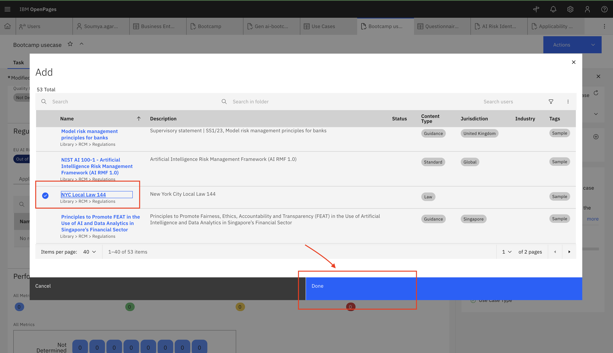

# 🧑‍💼 Managing AI Risk and Compliance with watsonx.governance

> **Interac watsonx Enablement Workshop.** Scenarios, personas, and data in this lab are fictional and for demonstration only.

<!-- 📸 Screenshot placeholder — hero image (unchanged from previous version) -->

## You need a separate Lab environment from IBM. Please refer to the document provided by IBMers.

> ℹ️ **This lab was rewritten for the new IBM OpenPages (Governance Console) UI.** The navigation, buttons, and workflow steps below reflect the current interface. Where the new UI differs from the older version, a **🔀 What changed** note calls it out so returning users can find the new location quickly.

## 👋 Meet Jose – The Chief Risk Officer

Jose works at **TechCorp Inc.**, a large multinational enterprise using AI to improve HR processes like hiring and employee planning.

But there was a problem...
AI was everywhere, but **nobody really knew**:
- Who built what
- Whether the models were fair
- If they followed rules like GDPR etc.
- What to do when something went wrong

Jose was responsible for managing all that risk — but he had **no clear way** to do it.

So, Jose and his team decided to leverage **watsonx.governance** to make AI governance easy, clear, and reliable.

## 🎯 What Jose Wanted to Fix

Jose didn't want to manage critical governance processes through spreadsheets, emails or Slack messages.

He wanted a simple system that would:

- ✅ **Track every AI model from start to finish**
- ✅ **Make sure models follow the rules (like GDPR, EU AI Act, etc.)**
- ✅ **Foster collaboration with the development team — without slowing them down**
- ✅ **Catch problems early and fix them fast**
- ✅ **Keep everything ready for audits**

And that's where **watsonx.governance** helps.

## 👥 Who's involved in AI Governance?

AI Governance is a team sport involving different roles in an organization. Though it's not uncommon to find scenarios where folks could perform several personas, here's what these roles might look like:

<!-- 📸 Screenshot placeholder — personas diagram (unchanged from previous version) -->

## 🚀 7-Step AI Governance Implementation (Used by Jose's Team)

A simple, structured process for managing AI models from idea to remediation.

<!-- 📸 Screenshot placeholder — architecture diagram (unchanged from previous version) -->

---

## 📄 Hands-on step-by-step lab

<!-- 📸 Screenshot placeholder — lab overview image (unchanged from previous version) -->

## This lab will walk you through the following steps in the AI Governance Framework

- [👩‍💼 1. Use Case Owner Responsibilities](#-1-use-case-owner-responsibilities)
- [👩‍💼 2. Business Unit Leader / Stakeholder Responsibilities](#-2-business-unit-leader--stakeholder-responsibilities)

## ⚙️ Pre-requisites

* Services: watsonx, OpenPages.

## 🚀 Getting Started

1. Login to the OpenPages Link IBMers provided

> [!IMPORTANT]
> After logging in, open the **User menu** (the person icon at the top-right of the OpenPages banner) and confirm your active profile.
>
> 🔀 **What changed:** The previous version of this lab used a profile named **`Watsonx governance MRG Master`**. In the current environment that profile does not exist — the equivalent AI-governance profile is **`MRG AI Factsheets Master`** *(described as "Profile for AI Factsheets (WKC) Integration")*. It is usually the default profile already.
>
> To check or switch: **User menu (person icon) → Change Profile → Select profile** → search for the profile → **Save**.

<!-- 📸 Screenshot placeholder — User menu > Change Profile > "Select profile" dialog showing MRG AI Factsheets Master -->

---

## 👩‍💼 1. Use Case Owner Responsibilities

As a Use Case Owner, your responsibilities include:

* Creating the business (parent) and child entities
* Defining the AI use case (AskHR – Agentic AI)
* Setting the risk level and submitting the use case for review
* Attaching a risk/compliance questionnaire assessment
* Associating applicable mandates / regulations

> Note: Typically the steps in this section are performed by the person who owns the AI use case (assigned the `Use case owner` role in IBM OpenPages). For the purpose of this lab you will continue to use the **`MRG AI Factsheets Master`** profile.

### Creating Business Entities

You will create a **Primary (parent) Business Entity** and a **Child Business Entity** in watsonx.governance for the **AskHR Project**, under the **TechCorp** organization.

In **IBM OpenPages**, a **Business Entity**:

* Represents a logical division or unit within an organization.
* Serves as a container for managing risks, controls, issues, and processes.
* Supports a parent/child hierarchy to enable structured governance.

#### 🎯 Structure to Be Created

| Entity Level   | Entity Name   | Description                                                        |
| -------------- | ------------- | ------------------------------------------------------------------ |
| Primary Entity | Techcorp      | Main entity representing the organization.                         |
| Child Entity   | AskHR - GenAI | GenAI use case entity under the AskHR project, linked to Techcorp. |

#### 1️⃣ Step 1: Create the Primary Business Entity — Techcorp

1. Click the **Hamburger Menu (☰)** at the top-left.
2. Go to **Organization → Business Entities**.

   > 🔀 **What changed:** The menu item is now **Business Entities** (plural).

3. Click the **New +** button (top-right of the list).

   > 🔀 **What changed:** The create button is now labelled **New +** (previously "Create New").

4. On the **New Business Entity** form, fill in the following fields:

   | Field                       | Value                                |
   | --------------------------- | ------------------------------------ |
   | **Name** *(required)*       | `Techcorp`                           |
   | **Description**             | Parent entity representing Techcorp. |
   | **Executive Owner**         | Search for your name and select it   |
   | **Entity Type**             | As applicable                        |
   | **Primary Business Entity** | *(leave empty — this is the parent)* |

   > 🔀 **What changed:** The owner field is now **Executive Owner** (previously "Owner"), and **Entity Type** replaces the old "Business Unit" field. A **Task guidance** panel on the right shows required fields and a progress bar.

5. Click **Save** (top-right).

<!-- 📸 Screenshot placeholder — New Business Entity form for Techcorp (Name, Description, Executive Owner filled) -->

#### 2️⃣ Step 2: Create the Child Business Entity — AskHR - GenAI

1. Go back to **Hamburger Menu (☰) → Organization → Business Entities** and click **New +** again.
2. Fill in the following fields:

   | Field                       | Value                                                    |
   | --------------------------- | -------------------------------------------------------- |
   | **Name** *(required)*       | `AskHR - GenAI`                                          |
   | **Description**             | Child entity for the GenAI use case under AskHR project. |
   | **Executive Owner**         | Search for your name and select it                       |
   | **Entity Type**             | As applicable                                            |
   | **Primary Business Entity** | Select `Techcorp` (see below).                           |

3. To set the parent, click **Select Primary Business Entity**, type `Techcorp` in the search box and **press Enter**, then click the **Techcorp** name to select it, and click **Done**.

   > 🔀 **What changed:** The lookup search only filters after you **press Enter**. Click the entity's **name link** to select it.

4. ✅ Ensure **Techcorp** is listed as the **Primary Business Entity**, then click **Save**.

<!-- 📸 Screenshot placeholder — New Business Entity form for AskHR - GenAI with Primary Business Entity = Techcorp -->

> ✅ **Verify:** After saving, the child entity record shows its **Folder** as **`Techcorp / AskHR - GenAI`**, confirming the parent/child hierarchy. (You can also create a child directly from the Techcorp record's **Child Business Entity → New Business Entity** button.)

<!-- 📸 Screenshot placeholder — AskHR - GenAI record showing Folder "Techcorp / AskHR - GenAI" -->

👏 **Well Done!** Structured Business Entities set a strong foundation for scalable, transparent, and well-governed AI initiatives.

---

### Creating and defining an AI Use Case

#### 📌 What is an AI Use Case?

An **AI Use Case** in IBM Governance Console documents and governs one or more models/agents developed to fulfill a specific business objective. It acts as a centralized record for development, compliance, risk tracking, and approval workflows.

> ✅ Create a use case whenever there's a business requirement that needs one or more AI/ML assets (models, prompts, or agents).

#### 1️⃣ Navigate to the AI Use Cases section

* Click the **Hamburger Menu (☰)**.
* Go to **Inventory → AI Use Cases**.

  > 🔀 **What changed:** The menu item is now **AI Use Cases** (previously "Use Case").

<!-- 📸 Screenshot placeholder — Inventory menu expanded showing "AI Use Cases" -->

#### 2️⃣ Click **New +**

* Click the **New +** button at the top-right of the AI Use Cases list.

<!-- 📸 Screenshot placeholder — AI Use Cases list with New + button -->

#### 3️⃣ Fill in the required fields

On the **New AI Use Case** form (the right-side **Task guidance** panel is titled *Model Request Creation*), the required fields are **Name, Purpose, Description, and Primary Business Entity**:

| Field                       | Example Entry                                   |
| --------------------------- | ----------------------------------------------- |
| **Name**                    | AskHR Automation using Agentic AI               |
| **Purpose**                 | Automate HR processes using Generative AI.      |
| **Description**             | This use case tracks GenAI-based HR automation. |
| **Primary Business Entity** | Techcorp                                         |

* The **Name** field is pre-filled with an auto-generated value (e.g., `Use Case_00xxx`) — overwrite it.
* To set the entity, scroll to the **Business Entities** section → **Primary Business Entity** tab → **Add** → search `Techcorp` (press Enter) → tick it → **Done**.

> 🔀 **What changed:** There is **no "Owner" field** on the create form in the new UI. The Primary Business Entity is set via the **Business Entities → Add** picker instead of a single dropdown.

<!-- 📸 Screenshot placeholder — New AI Use Case form filled in, with Primary Business Entity = Techcorp -->

#### 4️⃣ Save the Use Case

* Click **Save**. The record opens showing **Status: Proposed** and **Risk Level: Low** (default).

<!-- 📸 Screenshot placeholder — saved AI Use Case record, Status = Proposed -->

#### 5️⃣ Set the Risk Level

1. On the record's **Task** tab, click the **pencil icon** (*"Reveal editable fields"*) in the toolbar to make fields editable.
2. In the **General Description** section, open the **Risk Level** dropdown and select **Medium** (Low / Medium / High are available).
3. Click **Save**.

   > 🔀 **What changed:** Risk Level lives in **General Description** and is edited via the **pencil ("Reveal editable fields")** toggle — not a separate "Risk" section.

<!-- 📸 Screenshot placeholder — Risk Level dropdown set to Medium in edit mode -->

#### 6️⃣ Submit for initial approval

* Click the **Action** button (top-right) → **Start Model Use Case Request - Initial Review**.
* Confirm in the dialog by clicking **Continue** (choose *Continue and close tab* only if you want to close the record).

  > 🔀 **What changed:** This replaces the old "Submit for initial approval". The action is now **Action → Start Model Use Case Request - Initial Review**.

* After submitting, the **Task guidance** panel shows **Workflow Information** — the use case is now at the **`Model Use Case Review`** stage, and the top-right button becomes **Actions**.

<!-- 📸 Screenshot placeholder — Action menu "Start Model Use Case Request - Initial Review" + confirmation dialog -->

#### 7️⃣ Attach a Risk / Compliance Questionnaire Assessment

Scroll down on the use case record to the **Risk and Compliance** section and open the **Questionnaire Assessments** tab. From here you can:

* **Link Existing Questionnaires** — attach a pre-existing assessment (e.g., *AI Use Case Risk*).
* **Add New Questionnaire** — create a new assessment from a template.
* **Copy Questionnaire Assessment** — clone an existing one.

For this lab, click **Link Existing Questionnaires**, pick a questionnaire (for example **`1 AI Use Case Risk_QA_...`** / *AI Use Case Onboarding Risk*), and click **Done**. The linked questionnaire appears in the table with its **Progress %, Risk Score, and Compliance Score**, plus a **Launch** link to open and complete it.

> 🔀 **What changed:** In the new UI the Risk & Applicability questionnaires are **not auto-generated** when you submit the use case. You attach them from **Risk and Compliance → Questionnaire Assessments** on the use case record (Link / Add / Copy). To fill one out, click **Launch** on its row. The exact questions in your environment's templates may differ from the older fixed questionnaires.

<!-- 📸 Screenshot placeholder — Risk and Compliance > Questionnaire Assessments with a linked questionnaire (Launch link) -->

📋 Reference — sample answers (if the AI Use Case Risk Identification questionnaire is available to fill via <b>Launch</b>)

##### AI Use case risk identification section

| Question                                                     | Answer         |
|--------------------------------------------------------------|----------------|
| Please describe the problem you're solving with AI.          | Building assistant to answer HR related questions. |
| Please describe the expected users of the model.             | Fulltime employees in the org in engineering, sales and HR domain |
| Are you planning to use generative AI model(s)?              | Yes            |
| Are you planning to use agentic AI?                          | Yes            |
| Will the model input include content provided by people?     | Yes            |
| Will the model input include personal information?           | Yes            |

##### Agentic AI Use Case Risk Identification

| Question                                                                 | Answer |
|--------------------------------------------------------------------------|--------|
| Does the agent make decisions that affect people?                        | Yes    |
| Does the use case require a person to work together with the agent?      | Yes    |
| Does the person make the final say on the agent's decisions/actions?     | Yes    |
| Is the agent being used for a different purpose than intended?           | No     |
| Is the agent expected to align with human values, ethics, or policies?   | Yes    |
| Do the agent's tasks require planning or revisiting actions?             | Yes    |
| Does the agent use other agents, tools, or resources?                    | Yes    |
| Can these tools/agents contain sensitive information?                    | No     |
| Do the agent's actions create, update, or delete content?               | No     |
| Are the agent's outputs used by other tools or agents?                  | No     |
| Is the agent's output observable by the user?                            | Yes    |
| Will an end user supply inputs to the agent?                             | Yes    |
| Will end users include people who may attack or misuse the agent?        | No     |
| Are any tools/agents used by the agent external to the organization?     | No     |

##### Applicability / Compliance Assessment

| Question                                                                       | Answer                                                                 |
|--------------------------------------------------------------------------------|------------------------------------------------------------------------|
| How would you classify your organization?                                      | None of the Above                                                     |
| The AI System may be out of scope – contact your Compliance Department...      | I confirm that I will contact the Compliance Department for guidance. |

> After answering, use **Actions → Submit and close** within the questionnaire UI.

#### 8️⃣ Associate a Mandate / Regulation

On the use case record, in the **Risk and Compliance** section, open the **Regulations** tab and click **Link Regulations**. Search for and select an appropriate mandate (for example **`12 CFR 225.8`**), then click **Done**.

> 🔀 **What changed:** The old "regulatory information → mandates → Add" step is now **Risk and Compliance → Regulations → Link Regulations**. (These entries live under *Library → RCA Library → Mandates* in the picker, so they are the same mandates.)

<!-- 📸 Screenshot placeholder — Regulations tab with Link Regulations picker / linked regulation -->

> ℹ️ **On per-risk review:** In the previous version the owner reviewed each generated risk and set its **Status = Approved** (Admin tab) before submitting for stakeholder review. In the new workflow, the review/approval is handled as a single workflow decision (see Section 2), so this per-risk status step is no longer required for the lab.

### 🎉 Well Done!

You have created a **Business Entity hierarchy**, defined an **AI Use Case**, set its **risk level**, submitted it for **initial review**, and attached a **questionnaire assessment** and a **mandate** in watsonx.governance.

Once the steps above are complete, the Use Case Owner waits for the reviewer to act (Section 2).

---

## 👩‍💼 2. Business Unit Leader / Stakeholder Responsibilities

As a Business Stakeholder, your input ensures the use case aligns with business strategy and acceptable risk levels. You perform the **review decision** that moves the use case forward (or sends it back).

> Note: Typically this is performed by a Business Stakeholder / Risk & Compliance Officer assigned the appropriate role. For this lab you continue to use the **`MRG AI Factsheets Master`** profile.

#### 📝 Task Summary

The use case **"AskHR Automation using Agentic AI"** is now at the **`Model Use Case Review`** workflow stage. As the reviewer, your job is to **approve, reject, or return** it.

#### 1️⃣ Open the Assigned Task

* Go to the **Home** page and open the **My Tasks** tab.
* Find the task for your use case. You can narrow the list with **Filter By: Workflow Name / Stage / Type** (columns: *Name, Type, Workflow Name, Stage (Status), Criticality, Stage Due Date*).
* Click the task to open the use case record.

  > 💡 You can also open the use case directly from **Inventory → AI Use Cases** — the review actions are the same.

<!-- 📸 Screenshot placeholder — Home > My Tasks list with the AskHR review task -->

#### 2️⃣ Review the key details

Review the use case before deciding:

* **Use Case details** (Name, Purpose, Description, Business Entity)
* **Risk Level**
* **Questionnaire Assessment** (Progress / Risk Score / Compliance Score)
* **Associated Regulations / Mandates**

<!-- 📸 Screenshot placeholder — use case record under review (Status = Proposed, Risk Level = Medium) -->

#### 3️⃣ Approve or Reject the Use Case

Click the **Actions** button (top-right) and choose one of the workflow actions:

| Action                                    | What it does                                                     |
| ----------------------------------------- | ---------------------------------------------------------------- |
| ✅ **Approve - Send Onboarding Questionnaire** | Approves the use case and advances the workflow. Status → **Approved**. |
| ❌ **Reject Use Case**                     | Rejects the use case.                                           |
| 🔁 **Return to Requestor for Updates**    | Sends it back to the Use Case Owner for revision.              |

Confirm your choice in the **"Are you sure you want to perform this action?"** dialog by clicking **Continue**.

> 🔀 **What changed:** The workflow decision is triggered from the top-right **Actions** button. (The **"Select an action to validate"** dropdown in the *Task guidance* panel only pre-selects/validates the action — the transition itself is confirmed from the **Actions** button.) This single decision replaces the old two-step "Submit for Stakeholder Review" → "Approve for Development".

<!-- 📸 Screenshot placeholder — Actions menu showing Approve / Reject / Return options + confirmation dialog -->

## 🎯 After You Submit

| If Approved                                | If Rejected / Returned                 |
| ------------------------------------------ | -------------------------------------- |
| Use case **Status → Approved**             | Sent back to the Use Case Owner        |
| Proceeds to onboarding / downstream steps  | Requires updates and resubmission      |

<!-- 📸 Screenshot placeholder — use case record showing Status = Approved -->

#### 🎉 Congratulations!

You've helped ensure this Agentic AI use case adheres to responsible-AI practices by:

* Validating the risk level
* Confirming regulatory and internal compliance
* Approving only well-governed use cases

> 🛡️ Governance is not a one-time check — it's a continuous loop of accountability and alignment.
