# 🧑‍💼 Managing AI Risk and Compliance with watsonx.governance

> **Interac watsonx Enablement Workshop.** Scenarios, personas, and data in this lab are fictional and for demonstration only.

<!-- 📸 Screenshot placeholder — hero image (unchanged from previous version) -->

## You need a separate Lab environment from IBM. Please refer to the document provided by IBMers.

> ℹ️ **This lab was rewritten for the new IBM OpenPages (Governance Console) UI.** The navigation, buttons, and workflow steps below reflect the current interface. Where the new UI differs from the older version, a **🔀 What changed** note calls it out so returning users can find the new location quickly.

## 👋 Meet Jose – The Chief Risk Officer

Jose works at **TechCorp Inc.**, a large multinational enterprise using AI to improve HR processes like hiring and employee planning.

But there was a problem...
AI was everywhere, but **nobody really knew**:
- Who built what
- Whether the models were fair
- If they followed rules like GDPR etc.
- What to do when something went wrong

Jose was responsible for managing all that risk — but he had **no clear way** to do it.

So, Jose and his team decided to leverage **watsonx.governance** to make AI governance easy, clear, and reliable.

## 🎯 What Jose Wanted to Fix

Jose didn't want to manage critical governance processes through spreadsheets, emails or Slack messages.

He wanted a simple system that would:

- ✅ **Track every AI model from start to finish**
- ✅ **Make sure models follow the rules (like GDPR, EU AI Act, etc.)**
- ✅ **Foster collaboration with the development team — without slowing them down**
- ✅ **Catch problems early and fix them fast**
- ✅ **Keep everything ready for audits**

And that's where **watsonx.governance** helps.

## 👥 Who's involved in AI Governance?

AI Governance is a team sport involving different roles in an organization. Though it's not uncommon to find scenarios where folks could perform several personas, here's what these roles might look like:

<!-- 📸 Screenshot placeholder — personas diagram (unchanged from previous version) -->

## 🚀 7-Step AI Governance Implementation (Used by Jose's Team)

A simple, structured process for managing AI models from idea to remediation.

<!-- 📸 Screenshot placeholder — architecture diagram (unchanged from previous version) -->
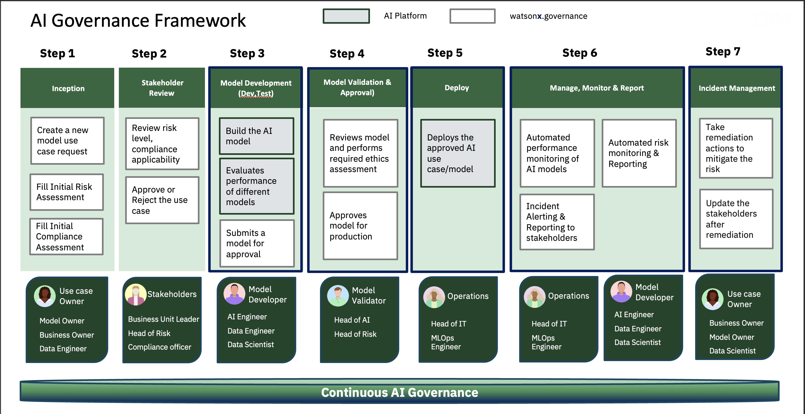

---

## 📄 Hands-on step-by-step lab

<!-- 📸 Screenshot placeholder — lab overview image (unchanged from previous version) -->

## This lab will walk you through the following steps in the AI Governance Framework

- [👩‍💼 1. Use Case Owner Responsibilities](#-1-use-case-owner-responsibilities)
- [👩‍💼 2. Business Unit Leader / Stakeholder Responsibilities](#-2-business-unit-leader--stakeholder-responsibilities)

## ⚙️ Pre-requisites

* Services: watsonx, OpenPages.

## 🚀 Getting Started

1. Login to the OpenPages Link IBMers provided

> [!IMPORTANT]
> After logging in, open the **User menu** (the person icon at the top-right of the OpenPages banner) and confirm your active profile.
>
> 🔀 **What changed:** The previous version of this lab used a profile named **`Watsonx governance MRG Master`**. In the current environment that profile does not exist — the equivalent AI-governance profile is **`MRG AI Factsheets Master`** *(described as "Profile for AI Factsheets (WKC) Integration")*. It is usually the default profile already.
>
> To check or switch: **User menu (person icon) → Change Profile → Select profile** → search for the profile → **Save**.

<!-- 📸 Screenshot placeholder — User menu > Change Profile > "Select profile" dialog showing MRG AI Factsheets Master -->
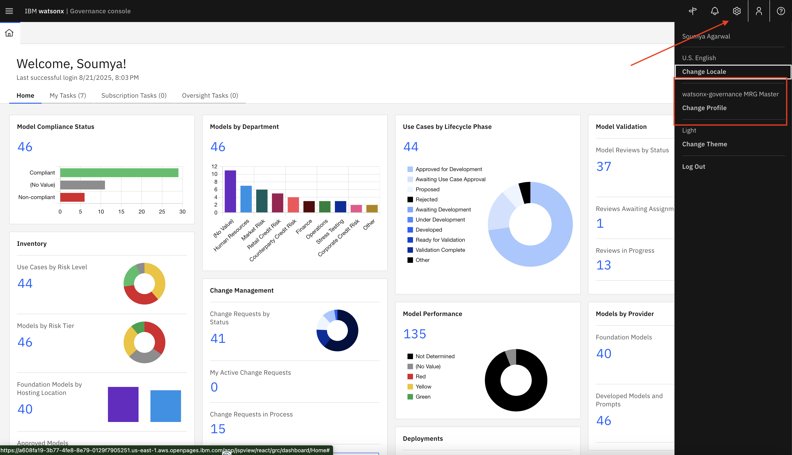

---

## 👩‍💼 1. Use Case Owner Responsibilities

As a Use Case Owner, your responsibilities include:

* Creating the business (parent) and child entities
* Defining the AI use case (AskHR – Agentic AI)
* Setting the risk level and submitting the use case for review
* Attaching a risk/compliance questionnaire assessment
* Associating applicable mandates / regulations

> Note: Typically the steps in this section are performed by the person who owns the AI use case (assigned the `Use case owner` role in IBM OpenPages). For the purpose of this lab you will continue to use the **`MRG AI Factsheets Master`** profile.

### Creating Business Entities

You will create a **Primary (parent) Business Entity** and a **Child Business Entity** in watsonx.governance for the **AskHR Project**, under the **TechCorp** organization.

In **IBM OpenPages**, a **Business Entity**:

* Represents a logical division or unit within an organization.
* Serves as a container for managing risks, controls, issues, and processes.
* Supports a parent/child hierarchy to enable structured governance.

#### 🎯 Structure to Be Created

| Entity Level   | Entity Name   | Description                                                        |
| -------------- | ------------- | ------------------------------------------------------------------ |
| Primary Entity | Techcorp      | Main entity representing the organization.                         |
| Child Entity   | AskHR - GenAI | GenAI use case entity under the AskHR project, linked to Techcorp. |

#### 1️⃣ Step 1: Create the Primary Business Entity — Techcorp

1. Click the **Hamburger Menu (☰)** at the top-left.
2. Go to **Organization → Business Entities**.

   > 🔀 **What changed:** The menu item is now **Business Entities** (plural).

3. Click the **New +** button (top-right of the list).

   > 🔀 **What changed:** The create button is now labelled **New +** (previously "Create New").

4. On the **New Business Entity** form, fill in the following fields:

   | Field                       | Value                                |
   | --------------------------- | ------------------------------------ |
   | **Name** *(required)*       | `Techcorp`                           |
   | **Description**             | Parent entity representing Techcorp. |
   | **Executive Owner**         | Search for your name and select it (Pick "System Administrator" this time)   |
   | **Entity Type**             | As applicable                        |
   | **Primary Business Entity** | *(leave empty — this is the parent)* |

   > 🔀 **What changed:** The owner field is now **Executive Owner** (previously "Owner"), and **Entity Type** replaces the old "Business Unit" field. A **Task guidance** panel on the right shows required fields and a progress bar.

5. Click **Save** (top-right).

<!-- 📸 Screenshot placeholder — New Business Entity form for Techcorp (Name, Description, Executive Owner filled) -->
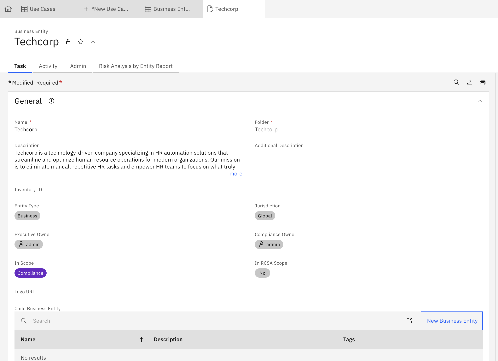

#### 2️⃣ Step 2: Create the Child Business Entity — AskHR - GenAI

1. Go back to **Hamburger Menu (☰) → Organization → Business Entities** and click **New +** again.
2. Fill in the following fields:

   | Field                       | Value                                                    |
   | --------------------------- | -------------------------------------------------------- |
   | **Name** *(required)*       | `AskHR - GenAI`                                          |
   | **Description**             | Child entity for the GenAI use case under AskHR project. |
   | **Executive Owner**         | Search for your name and select it (Pick "System Administrator" this time)                       |
   | **Entity Type**             | As applicable                                            |
   | **Primary Business Entity** | Select `Techcorp` (see below).                           |

3. To set the parent, click **Select Primary Business Entity**, type `Techcorp` in the search box and **press Enter**, then click the **Techcorp** name to select it, and click **Done**.

   > 🔀 **What changed:** The lookup search only filters after you **press Enter**. Click the entity's **name link** to select it.

4. ✅ Ensure **Techcorp** is listed as the **Primary Business Entity**, then click **Save**.

> ✅ **Verify:** After saving, the child entity record shows its **Folder** as **`Techcorp / AskHR - GenAI`**, confirming the parent/child hierarchy. (You can also create a child directly from the Techcorp record's **Child Business Entity → New Business Entity** button.)

👏 **Well Done!** Structured Business Entities set a strong foundation for scalable, transparent, and well-governed AI initiatives.

---

### Creating and defining an AI Use Case

#### 📌 What is an AI Use Case?

An **AI Use Case** in IBM Governance Console documents and governs one or more models/agents developed to fulfill a specific business objective. It acts as a centralized record for development, compliance, risk tracking, and approval workflows.

> ✅ Create a use case whenever there's a business requirement that needs one or more AI/ML assets (models, prompts, or agents).

#### 1️⃣ Navigate to the AI Use Cases section

* Click the **Hamburger Menu (☰)**.
* Go to **Inventory → AI Use Cases**.

  > 🔀 **What changed:** The menu item is now **AI Use Cases** (previously "Use Case").

<!-- 📸 Screenshot placeholder — Inventory menu expanded showing "AI Use Cases" -->
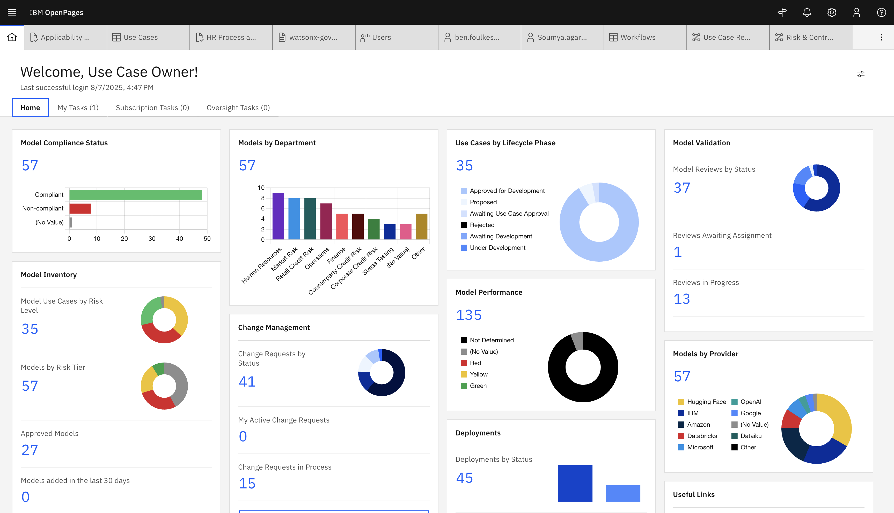

#### 2️⃣ Click **New +**

* Click the **New +** button at the top-right of the AI Use Cases list.

<!-- 📸 Screenshot placeholder — AI Use Cases list with New + button -->

#### 3️⃣ Fill in the required fields

On the **New AI Use Case** form (the right-side **Task guidance** panel is titled *Model Request Creation*), the required fields are **Name, Purpose, Description, and Primary Business Entity**:

| Field                       | Example Entry                                   |
| --------------------------- | ----------------------------------------------- |
| **Name**                    | AskHR Automation using Agentic AI               |
| **Purpose**                 | Automate HR processes using Generative AI.      |
| **Description**             | This use case tracks GenAI-based HR automation. |
| **Primary Business Entity** | Techcorp                                         |

* The **Name** field is pre-filled with an auto-generated value (e.g., `Use Case_00xxx`) — overwrite it.
* To set the entity, scroll to the **Business Entities** section → **Primary Business Entity** tab → **Add** → search `Techcorp` (press Enter) → tick it → **Done**.

> 🔀 **What changed:** There is **no "Owner" field** on the create form in the new UI. The Primary Business Entity is set via the **Business Entities → Add** picker instead of a single dropdown.

<!-- 📸 Screenshot placeholder — New AI Use Case form filled in, with Primary Business Entity = Techcorp -->
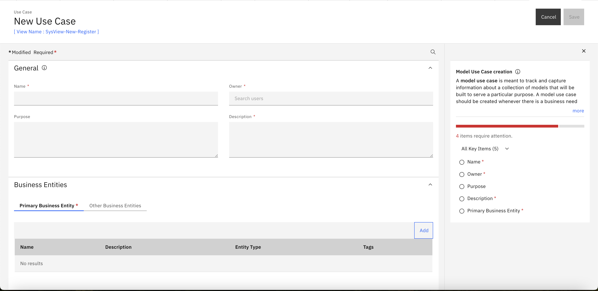

#### 4️⃣ Save the Use Case

* Click **Save**. The record opens showing **Status: Proposed** and **Risk Level: Low** (default).

<!-- 📸 Screenshot placeholder — saved AI Use Case record, Status = Proposed -->
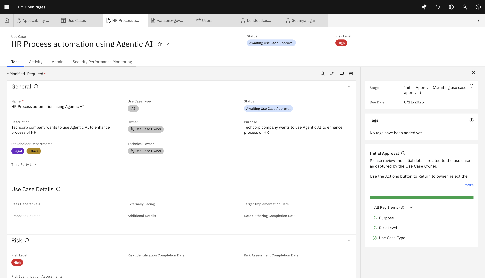

#### 5️⃣ Set the Risk Level

1. On the record's **Task** tab, click the **pencil icon** (*"Reveal editable fields"*) in the toolbar to make fields editable.
2. In the **General Description** section, open the **Risk Level** dropdown and select **Medium** (Low / Medium / High are available).
3. Click **Save**.

   > 🔀 **What changed:** Risk Level lives in **General Description** and is edited via the **pencil ("Reveal editable fields")** toggle — not a separate "Risk" section.

<!-- 📸 Screenshot placeholder — Risk Level dropdown set to Medium in edit mode -->
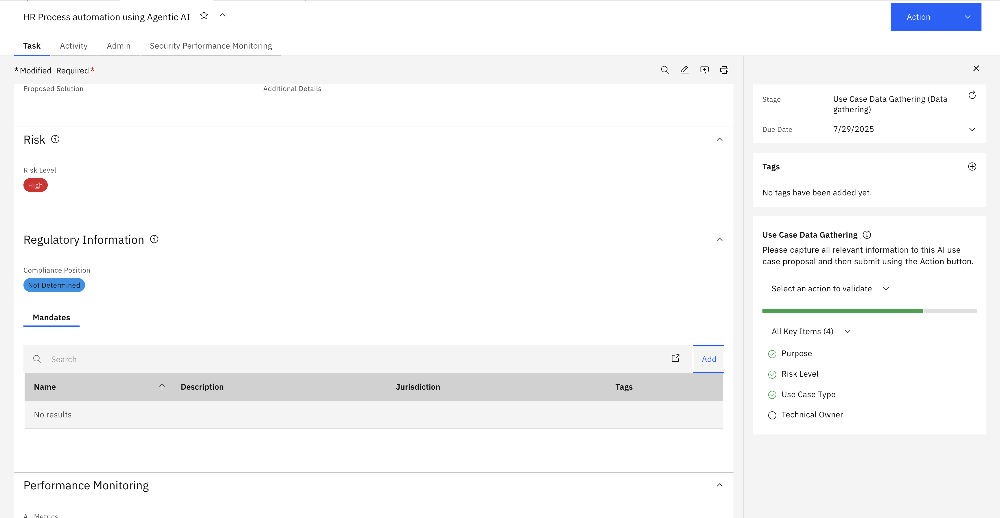

#### 6️⃣ Submit for initial approval

* Click the **Action** button (top-right) → **Start Model Use Case Request - Initial Review**.
* Confirm in the dialog by clicking **Continue** (choose *Continue and close tab* only if you want to close the record).

  > 🔀 **What changed:** This replaces the old "Submit for initial approval". The action is now **Action → Start Model Use Case Request - Initial Review**.

* After submitting, the **Task guidance** panel shows **Workflow Information** — the use case is now at the **`Model Use Case Review`** stage, and the top-right button becomes **Actions**.

<!-- 📸 Screenshot placeholder — Action menu "Start Model Use Case Request - Initial Review" + confirmation dialog -->
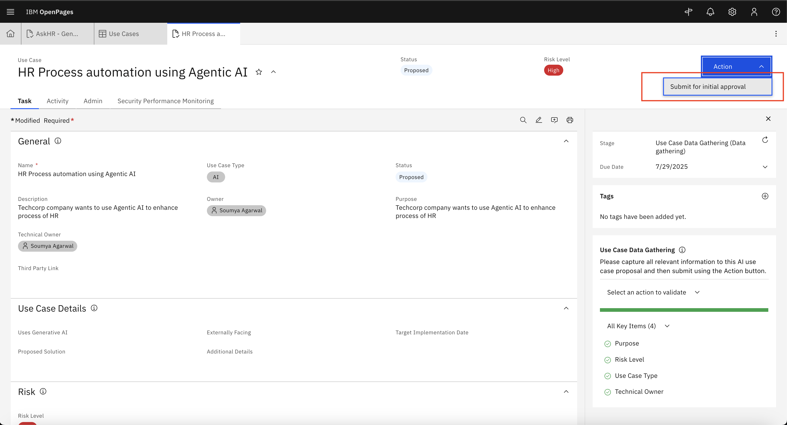

#### 7️⃣ Attach & Complete a Risk / Compliance Questionnaire Assessment

Scroll down on the use case record to the **Risk and Compliance** section and open the **Questionnaire Assessments** tab. From here you can:

* **Link Existing Questionnaires** — attach a pre-existing assessment (e.g., *AI Use Case Risk*).
* **Add New Questionnaire** — create a new assessment from a template.
* **Copy Questionnaire Assessment** — clone an existing one.

For this lab, click **Add New Questionnaire**. In the **Select Questionnaire Template dialog**, choose a template — for example **`AI System Information Gathering`** (*AI Onboarding Questionnaire*) — click **Done**, then **Save**.

 After **Save** click **Launch Questionnaire UI** in the next page
 

**Completing the questionnaire**
Use the **View all questions** dropdown and switch it to **View incomplete questions** to work through only what's left. Answer each question (radio buttons, checkboxes, or text fields), then click **Save draft**.

> 💡 **Tip:** Some answers reveal **conditional follow-up questions** (e.g., answering *Yes* to "Does the AI system replace another type of system?" adds a *"Why does that system need to be replaced?"* text field), so the total question count grows as you go. **View incomplete questions** makes it easy to catch them all.

> 🔀 **What changed:** In the new UI the Risk & Applicability questionnaires are **not auto-generated** when you submit the use case. You attach them from **Risk and Compliance → Questionnaire Assessments** on the use case record (**Add New** / **Link Existing** / **Copy**), then click **Launch** (or the **Questionnaire** tab) to complete them. The available templates and their questions differ from the older fixed questionnaires — the example below uses the **AI System Information Gathering** template.

📋 Reference — sample answers for the <b>AI System Information Gathering</b> questionnaire (AskHR Agentic-AI use case)

> Illustrative answers for this lab. Items marked ↳ are **conditional follow-ups** that appear only after the parent question is answered. Identity/free-text answers are examples — substitute your own.

##### Section 1 — Jurisdiction and Compliance

| Question | Answer |
|----------|--------|
| Does this use case involve algorithmic decision tools or an AI model/system (ML, logic-/knowledge-based, or statistical)? | Yes |
| Will the tool/model/system be placed on the market or put into service in the European Union? | No |
| Will it be sold to, deployed in, or provide services to users in the United States? | No |
| Will it be sold to, deployed by, or provide services on behalf of the Canadian Federal government? | No |
| Could it exploit vulnerabilities of a specific group (age, disability) to distort behavior and cause harm? | No |
| Will the model deploy subliminal techniques to distort behavior and cause harm? | No |
| Will the use case propose/classify the trustworthiness of persons (social scoring)? | No |
| Will it perform 'real-time' remote biometric identification in public spaces for law enforcement? | No |
| How are you? | Not applicable |
| Who is your manager? | *(pick/enter a user, e.g. your manager)* |

##### Section 2 — Objective and proportionality

| Question | Answer |
|----------|--------|
| Is personal data processed by the system? | Yes |
| Is the objective (purpose) of the processing clearly defined? | Yes |
| Are the learning and production phases of the AI system separate? | Yes |
| ↳ If so, is a second assessment planned for the production phase? | No |
| Are the individuals who interact with the system / are subject to automated decisions identified? | Yes |
| ↳ What are their characteristics (age, gender, physical details, etc.)? | e.g. "Full-time employees (adults, 18+) across engineering, sales, and HR." |
| ↳ How many of them are there? | e.g. "Approximately 5,000 employees" |
| Will the processing result in legal, financial or physical consequences for health, social status or safety? | No |
| Does the AI system replace another type of system for the task it is assigned? | Yes |
| ↳ Why does that system need to be replaced? | e.g. "The manual HR support process was slow and inconsistent; the AI assistant is faster, 24/7, and consistent." |
| Does the AI system have a significant advantage (efficiency, cost, privacy, etc.) vs. other solutions? | Yes |
| Does this significant advantage outweigh the potential additional risks? | Yes |

##### Section 2 — Providers, users of AI systems and individuals

| Question | Answer |
|----------|--------|
| If personal data is collected/used, has a data controller been identified? | Yes |
| Are the legal persons in charge of AI system development, deployment and monitoring clearly defined? | Yes |
| Do the natural persons in charge of development have the appropriate training? | Yes |
| Have they been made aware of the legal, technical, ethical and moral issues of AI? | Yes |
| Is there an internal charter or policy governing the design and deployment of AI systems? | Yes |
| Are the individuals in charge of maintaining/correcting the AI system clearly identified and known to everyone? | Yes |
| What is your tenure in the organization? | 10+ Years |

> After answering all questions, click **Save draft** (and, when required by your workflow, use **Actions → Submit** on the assessment record).

You will be able to see **Risk Score** and **Compliance Score** after finish the questionnaire

#### 8️⃣ Associate a Mandate / Regulation

On the use case record, in the **Risk and Compliance** section, 

open the **Regulations** tab and click **Link Regulations**. Search for and select an appropriate mandate (for example **`12 CFR 225.8`**), then click **Done**.

> **Why these two steps matter**
>
> Completing the **questionnaire assessment** is how the use case owner surfaces the risk and compliance profile of the AI system. By answering structured questions about jurisdiction, data usage, agentic behavior, and accountability, the questionnaire automatically calculates a **Risk Score** and **Compliance Score**, flags potentially prohibited or high-risk practices, and creates a documented, auditable record of the system's characteristics — so decisions about the model aren't based on assumptions, but on a consistent, repeatable evaluation.
>
> **Associating a regulation (mandate)** establishes a formal link between the AI use case and the specific laws and regulatory obligations it must comply with (e.g., GDPR, the EU AI Act). This provides end-to-end **traceability** — anyone reviewing the use case can immediately see which regulations apply — and connects the use case to the related controls, requirements, and policies needed to satisfy those regulations. Together, the questionnaire and the mandate association keep the initiative **audit-ready** and enable risk and compliance reporting across the AI portfolio.

> ℹ️ **On per-risk review:** In the previous version the owner reviewed each generated risk and set its **Status = Approved** (Admin tab) before submitting for stakeholder review. In the new workflow, the review/approval is handled as a single workflow decision (see Section 2), so this per-risk status step is no longer required for the lab.

### 🎉 Well Done!

You have created a **Business Entity hierarchy**, defined an **AI Use Case**, set its **risk level**, submitted it for **initial review**, and attached a **questionnaire assessment** and a **mandate** in watsonx.governance.

Once the steps above are complete, the Use Case Owner waits for the reviewer to act (Section 2).

---

## 👩‍💼 2. Business Unit Leader / Stakeholder Responsibilities

As a Business Stakeholder, your input ensures the use case aligns with business strategy and acceptable risk levels. You perform the **review decision** that moves the use case forward (or sends it back).

> Note: Typically this is performed by a Business Stakeholder / Risk & Compliance Officer assigned the appropriate role. For this lab you continue to use the **`MRG AI Factsheets Master`** profile.

#### 📝 Task Summary

The use case **"AskHR Automation using Agentic AI"** is now at the **`Model Use Case Review`** workflow stage, with a status of **`Awaiting Approval`**. As the reviewer, your job is to **approve, reject, or return** it.

#### 1️⃣ Open the Use Case Under Review

Open the use case record directly from the inventory:

* Go to **Inventory → AI Use Cases**.
* If the grid looks empty or unexpectedly short, **clear the search box first** — a leftover keyword (e.g. `ASK`) plus the *Default Filter* can hide the record you just created.
* Locate **`AskHR Automation using Agentic AI`** (Status = **Awaiting Approval**) and click its name to open the record.

> ⚠️ **Heads-up — don't hunt for this under Home → My Tasks.**
> In this environment the **My Tasks / Subscription Tasks** dashboard widgets only surface a fixed set of object types (Audit, Control, Issue, Business Continuity Plan, Risk Assessment, Model, etc.). **AI Use Case review tasks are *not* listed there**, so the review is driven from the **use case record itself**, not from the task dashboard. Opening it from **Inventory → AI Use Cases** is the reliable path — the Actions available on the record are the same review actions.

<!-- 📸 Screenshot placeholder — Inventory > AI Use Cases with the AskHR record (Status = Awaiting Approval) -->
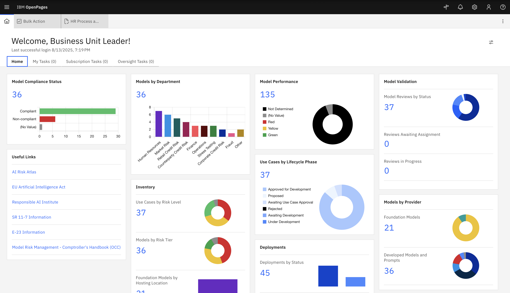

#### 2️⃣ Review the key details

Review the use case before deciding:

* **Use Case details** (Name, Purpose, Description, Business Entity)
* **Risk Level**
* **Questionnaire Assessment** (Progress / Risk Score / Compliance Score)
* **Associated Regulations / Mandates**

<!-- 📸 Screenshot placeholder — use case record under review (Status = Awaiting Approval, Risk Level = Medium) -->
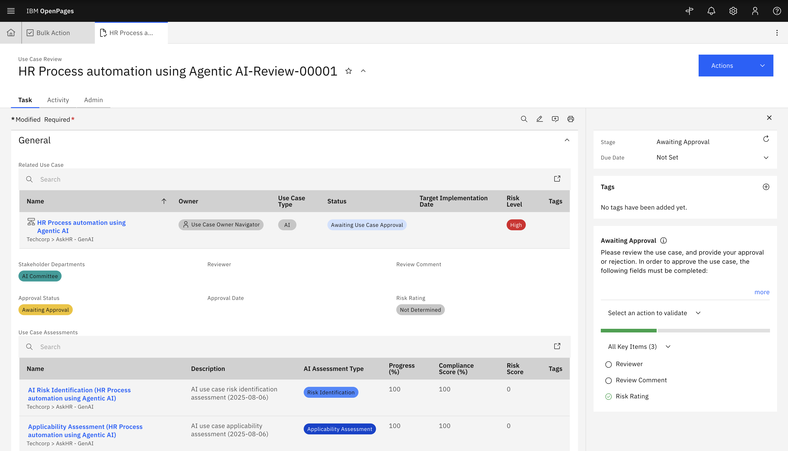

#### 3️⃣ Approve, Reject, or Return the Use Case

Click the **Actions** button (top-right) and choose one of the workflow actions:

| Action                                        | What it does                                                            |
| --------------------------------------------- | ----------------------------------------------------------------------- |
| ✅ **Approve - Send Onboarding Questionnaire** | Approves the use case and advances the workflow. Status → **Approved**. |
| ❌ **Reject Use Case**                         | Rejects the use case.                                                    |
| 🔁 **Return to Requestor for Updates**        | Sends it back to the Use Case Owner for revision.                        |

Confirm your choice in the **"Are you sure you want to perform this action?"** dialog by clicking **Continue**.

> 🔀 **What changed:** The workflow decision is triggered from the top-right **Actions** button. (The **"Select an action to validate"** dropdown in the *Task guidance* panel only pre-selects/validates the action — the transition itself is confirmed from the **Actions** button.) This single decision replaces the old two-step "Submit for Stakeholder Review" → "Approve for Development".

<!-- 📸 Screenshot placeholder — Actions menu showing Approve / Reject / Return options + confirmation dialog -->
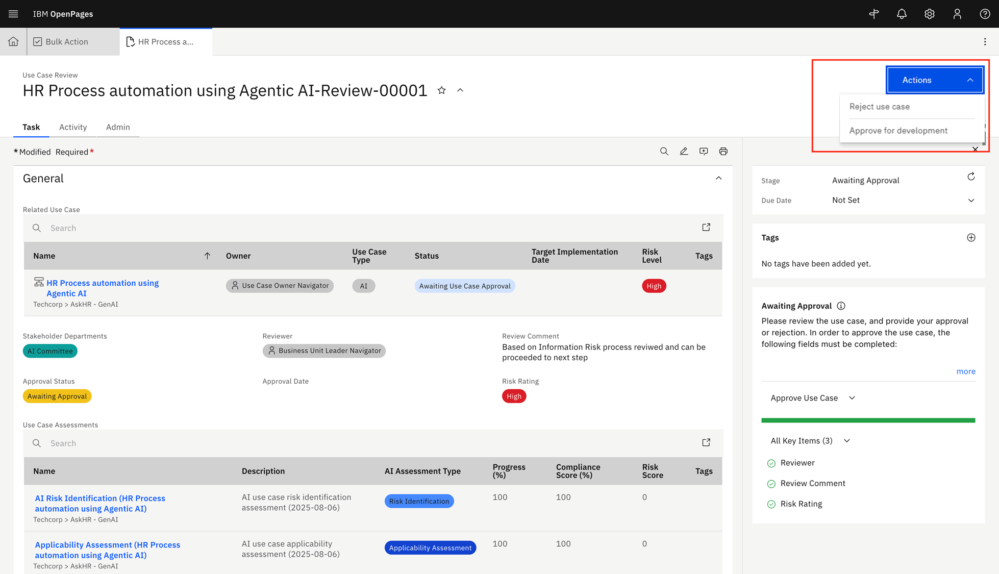

## 🎯 After You Submit

| If Approved                               | If Rejected / Returned          |
| ----------------------------------------- | ------------------------------- |
| Use case **Status → Approved**            | Sent back to the Use Case Owner |
| Proceeds to onboarding / downstream steps | Requires updates and resubmission |

## 🧭 Why the Business Unit Leader Makes This Call

This review gate is deliberately placed with the Business Unit Leader / Business Stakeholder — not with the team that built the use case — for reasons that sit at the heart of AI governance:

* **Separation of duties.** The people who request and build an AI use case should not be the ones who approve it for themselves. Assigning the decision to an independent business leader turns the review into a real control rather than a self-signed rubber stamp — a core expectation of model-risk frameworks (e.g., SR 11-7) and AI regulations such as the EU AI Act.

* **Business alignment and risk-appetite ownership.** Technical teams can confirm that a model *works*; only a business leader can confirm that it *should exist* — that it supports the business strategy, addresses a genuine need, and stays within the level of risk the business is willing to accept. HR automation in particular touches employees and hiring decisions, so a business owner must weigh whether the value justifies the exposure.

* **Formal risk acceptance and accountability.** Approving the use case is an explicit acceptance of its residual risk by someone with the authority to own the consequences. That accountability is what allows the use case to move into development with confidence, and it gives auditors and regulators a named, responsible decision-maker.

* **A documented, auditable decision point.** The Approve / Reject / Return action, together with the confirmation dialog, records *who* decided *what* and *when*. This audit trail is far stronger than an informal email sign-off and is exactly the evidence internal audit, compliance, and external regulators expect to see.

* **A genuine gate, not a formality.** Because the reviewer can **Return for updates** or **Reject** outright, low-value, non-compliant, or high-risk use cases are stopped *before* they consume development effort or reach production. This keeps ungoverned AI out of the enterprise and focuses resources on use cases that have cleared business and risk scrutiny.

In short, the Business Unit Leader converts a technical artifact into a **governed business decision** — ensuring that every AI use case which proceeds is wanted by the business, understood in terms of risk, owned by an accountable leader, and documented for anyone who later asks *"who approved this, and why?"*

#### 🎉 Congratulations!

You've helped ensure this Agentic AI use case adheres to responsible-AI practices by:

* Validating the risk level
* Confirming regulatory and internal compliance
* Approving only well-governed use cases

> 🛡️ Governance is not a one-time check — it's a continuous loop of accountability and alignment.
